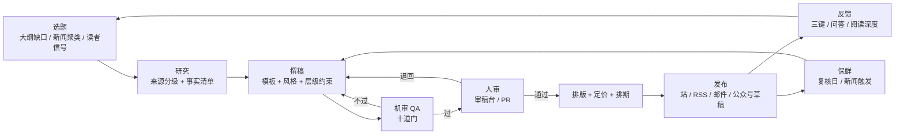
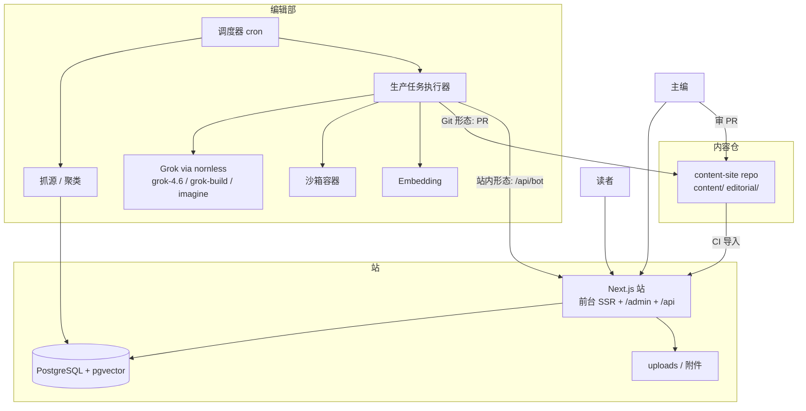

# AIGC 知识付费站 · Grok 写作与内容运营规划

更新：2026-09-14
路径：`/Users/himma/01/01Agent学习/aigc知识付费`
配套：`00-网站规划.md`（付费墙 / 分组 / 权限 / 数据表）、`01-页面设计.md`（视觉与线框）、`02-DeepSeek-Harness集成.md`（B 路脚手架）
状态：**提案，待拍板**（决策清单见第 13 节）

## 0. 这份文档改了什么

`00` 的前提是「内容源就是手上已有的 Markdown，自己上传」。素材盘点（2026-09-04）的结论是现有材料撑不起一个平台。本文把内容源换成 **Grok 写、人审、持续更新**，站点从「上传 + 卖」变成「生产 + 卖 + 保鲜」。

| | `00` 原设定 | 本文 |
|---|---|---|
| 内容来源 | 手上 Markdown，手动上传 | Grok 编辑部流水线产出，人审后发 |
| 内容组织 | 分类（校园 / 认知原理 / Agent 工程 / AIGC 生产） | **层级 × 领域** 矩阵 + 新闻线 + 参考线（术语 / 工具 / 评测 / 资源） |
| 更新 | 发了就放着 | 每篇有复核日；新闻触发知识文更新 |
| 收费 | 单篇 + 分组 | 单篇 + 分组 + **会员** + 资源包 + 企业 |
| 后台 | 内容 / 分组 / 订单 | 加 **选题看板 / 生产任务 / 审稿台 / 新闻源 / 保鲜 / 分发 / 成本** |

**不变的**：权限只在一处算、付费正文服务端裁切、专属 404、分组模型、`<!-- more -->` 预览、书页视觉、第 1 版不接支付 SDK、不做 LMS、不做 DRM。`00` 的数据表和 `01` 的页面全部保留，本文只加不减。

## 1. 定位

**一句话**：一座给中文读者的 AI 知识阶梯 + 每日 AI 简报，由 Grok 撰写、人工审核、持续保鲜，免费层做量、付费层做钱。

**受众（按优先级）**

1. 付费主力：程序员 / 产品 / 运营等从业者，要「搭建 → 应用 → 原理」（L2–L4）。
2. 免费流量：大学生、职场新手，要「常识 → 上手」（L0–L1）。这批人也是课程和分组（某班）的来源。
3. 大单：企业 / 学校内训，按分组买（`00` 的分组模型已经覆盖）。

**差异化（AI 写的文满地都是，靠什么活）**

- **阶梯而不是散文**：每篇都在地图上有位置，有前置、有后续，读者知道自己在哪一层。散装 AI 文没有这个。
- **国内可直连优先**：所有方案先给不翻墙就能用的，海外方案单独标注。沿用大学课的原则。
- **实测标记**：教程类由 bot 在沙箱里真跑过命令 / 代码才发；文章上写「实测环境 + 日期」。
- **新闻带背景**：每条简报挂关联知识文，「这条新闻为什么和你有关」。新闻是流量，知识文是转化。
- **保鲜**：AI 领域三个月就过期。每篇有复核日，模型 / 价格 / 界面变了自动出更新任务。
- **透明**：每篇公开 AI 撰写、谁审、来源几条、何时核过。信任卡是产品的一部分。

## 2. 内容体系

### 2.1 层级 × 领域矩阵

你给的是 常识 → 搭建 → 应用 → 原理 四段。补齐后是六层，每层回答一个读者问题：

| 层 | 名称 | 读者的问题 | 默认访问 |
|---|---|---|---|
| L0 | 常识 | 这是什么？跟我有什么关系？ | 免费 |
| L1 | 上手 | 我今天怎么用起来？ | 免费为主，少量收费 |
| L2 | 搭建 | 怎么装、怎么接、怎么配？ | 收费为主 |
| L3 | 应用 | 怎么做成一件真活？ | 收费 |
| L4 | 原理 | 为什么是这样？边界在哪？ | 收费 / 会员 |
| L5 | 前沿 | 最新的研究在往哪走？ | 会员 |

**你说的「中间环节缺失」**，缺的主要是三段：

- 常识与搭建之间缺 **L1 上手**：不装任何东西，把现成产品用好。这层流量最大，也是学生和职场新手真正的起点。
- 搭建与应用之间缺 **集成与工作流**（放 L2 末 / L3 初）：API、自动化、把几个工具串起来。
- 应用与原理之间缺 **评估、成本、安全**（放 L3 末）：怎么测你的 Agent 不退化、token 账怎么算、什么数据不能出去。不懂这些直接读原理会飘。

领域是另一个轴，沿用 `00` 的分类思路再补两列：

| 领域 | 覆盖 |
|---|---|
| 通用认知 | 概念、边界、选型、隐私、伦理 |
| 办公与学习 | 文档 / 表格 / PPT / 阅读 / 备考 / 会议 |
| 开发与 Agent | API、编码代理、Harness、Skills、RAG、MCP、自动化 |
| AIGC 创作 | 文 → 图 → 视频 → 音频 → 发布，版权商用 |
| 行业应用 | 教育、制造、办公、法务、财务等场景案例 |
| 原理与研究 | 模型、训练、推理、检索、评测、安全 |

每篇文章 = 一个格子里的一个节点。**缺口 = 空格子，或某篇的前置节点不存在。**

### 2.2 首发大纲样例（约 70 节点，供改）

L0 常识（全免费）

- AI、机器学习、大模型、生成式 AI 四个词的关系
- 国内能直接用的对话产品有哪些，怎么选（千问 / 豆包 / Kimi / DeepSeek / 文心 / 混元）
- 大模型为什么一本正经地胡说（幻觉）
- token、上下文窗口、参数量：最常被问的三个词
- 免费版和付费版差在哪，什么时候值得付
- 四段提问法：背景 / 任务 / 要求 / 示例
- AI 能做什么、不能做什么：一张边界图
- 什么不要发给 AI：隐私与保密
- 文字之外：生图、生视频、语音各能做到什么程度
- 用 AI 学习和抄作业的区别（配大学课的 AI 使用声明）

L1 上手（免费为主）

- 用 AI 写文档 / 邮件 / 周报的完整工作流
- 读长文和论文：总结 → 追问 → 复述 三步
- 表格与数据的初步分析
- PPT 大纲与配图
- 国内生图工具上手（一篇一个工具）
- 语音转写与会议纪要
- 备考与刷题助手
- 常见翻车与纠正方法（多模型交叉验证）
- 建立个人提示词库
- 手机上怎么用（App / 小程序 / 输入法）

L2 搭建（收费为主）

- API 是什么，第一次调用：Key、计费、OpenAI 兼容协议
- 本地跑模型：Ollama / LM Studio，硬件门槛
- Cursor 装配与工作方式
- Claude Code 从零到用（现有文合规重写）
- Codex 从零到用（现有文合规重写）
- Obsidian 个人知识库 + AI（现有文重写）
- 工作流平台选一个：Dify / Coze / n8n
- RAG 入门：把你的文档接进模型
- MCP 是什么，接第一个工具
- 提示词工程进阶：结构化输出、few-shot、思维链
- 成本控制：token 计费、缓存、模型分层
- 数据安全与私有化部署概览

L3 应用（收费）

- Agent 工程：Harness、Skills、子代理、审批（现有 Harness 文精炼）
- Vibe Coding 六阶段：从想法到可用小程序
- 企业知识库落地：结构 / 非结构分轨
- 自动化三例：日报 bot、舆情监控、客服问答
- AIGC 生产线：brief → 脚本 → 图 → 视频 → 发布（生产轨，从零写）
- 教育场景：备课、出题、批改，以及边界
- 评估与回归：怎么测你的 Agent 没退化
- 案例复盘模板（背景 / 工具 / 提示词 / 产出 / 复盘）
- 个人 AI OS：一个人的工作台怎么搭（现有对话总结重写）

L4 原理（收费 / 会员）

- Transformer 一图讲清
- 分词与嵌入
- 预训练 / 微调 / RLHF
- 推理、采样、温度
- 上下文、KV cache、长上下文的代价
- 量化与部署
- 检索与向量数据库原理
- Scaling law 与模型演进（现有三份原理文合并为一版读本）
- 多模态如何统一
- Agent 架构与工具调用原理
- 评测基准怎么读、怎么被刷
- 安全与对齐概览

L5 前沿（会员）

- 论文解读，跟新闻线联动：一个大发布 → 一篇技术报告解读。

### 2.3 新闻线

| 体裁 | 频率 | 长度 | 访问 |
|---|---|---|---|
| 日报 | 每天 1 期，8–12 条 | 每条 2–3 句 + 来源 + 「与你有关」标签 + 关联知识文 | 免费 |
| 周深度 | 每周 1 篇 | 1500–3000 字，一个主题讲透 | 收费 / 会员 |
| 专题页 | 事件驱动 | 一个事件（大模型发布 / 政策 / 开源）的时间线 + 所有相关文 | 免费（页）+ 内部文各按自身访问 |
| 月报 | 每月 1 篇 | 榜单变化、价格变化、开源动态、趋势判断 | 会员 |

**来源分三级**，写作时按级标注：

- 官方：各实验室 / 厂商博客与发布页（海外：OpenAI、Anthropic、Google DeepMind、Meta、xAI、Mistral；国内：DeepSeek、通义、智谱、月之暗面、字节 Seed、百度、腾讯混元、MiniMax、阶跃等）、GitHub Releases、Hugging Face、arXiv、监管部门。
- 二手：机器之心、量子位、新智元、36氪、Hacker News 等。只做线索，必须回溯到官方。
- 社媒：X 上研究者与官方账号。**这是 Grok 的独有优势**（原生 X 检索），但只当线索，不当事实。

**打分**：重要性（官方、量级）× 受众相关（国内能不能用）× 新鲜度（库里没写过）× 可操作（读者今天能做什么）。低于阈值不进日报。

**不做**：时政类新闻信息（需要许可）、整段转载、未核实的爆料。

### 2.4 补充的内容线（你问「还有什么可以补充」）

| 线 | 是什么 | 为什么值得 | 访问 | 阶段 |
|---|---|---|---|---|
| 术语表 | 每个术语一张卡：一句话 / 一段 / 相关文 | SEO 入口；正文悬停解释；bot 顺手就能产 | 免费 | S0 |
| 评测与选型 | 模型对比、工具对比、API 价格表、「这周该用哪个」 | 从业者最愿意付费的时效内容；天然需要保鲜 | 收费 | S4 |
| 工具目录 | AI 工具库：标签、国内可直连、价格、更新日志 | 免费流量 + 给新闻线供线索 | 免费 | S4 |
| 资源包 | 提示词库、SOP、检查清单、模板，可下载 | 一次性购买品，客单价高于单篇 | 收费 | S4 |
| 学习路径 | 有序文章列表 + 「读到哪了」：零基础 30 天 / 程序员 Agent 14 天 / 老师用 AI 备课 | 把矩阵串成产品；会员的核心权益 | 免费路径 + 收费路径 | S2 |
| 问答沉淀 | 读者提问 → 助教按已解锁内容作答 → 高频问题变成新文章 | **最好的缺口探测器**；也是 `02` 的 H5 | 会员 | S4 |
| 专题与时间线 | 大事时间线、模型谱系图 | 常青参考页，分享率高 | 免费 | S3 |
| 个性化改写 | 「把这篇改成我的水平 / 我的岗位」，服务端生成并缓存 | 只有 AI 站做得到；会员核心权益 | 会员 | S4 |
| 音频版 | 文章 TTS，通勤听 | 复用内容，成本低 | 会员 | 要了再做 |
| 企业专区 | 按公司语境定制的文章与路径、席位管理 | 分组模型的自然延伸 | 企业 | S5 |

暂不做：评论区（审核成本高，先用「有用 / 没看懂 / 过时了」三键反馈 + 问答）；社区；直播；论文全文翻译（版权，只做解读）。

### 2.5 体裁与模板

每种体裁一份模板文件，放 `editorial/templates/`，bot 按模板写、QA 按模板查。

| 体裁 `kind` | 结构 | 字数 |
|---|---|---|
| `article` 知识文 | 读完你能… → 正文（先结论后展开）→ 小结 → 下一步读什么 → 来源 | L0–L1 1200–2000；L2–L4 2000–4000 |
| `tutorial` 教程 | 读完你能… → 环境与前置 → 步骤（每步一个可验证结果）→ 常见问题 → 实测记录 → 下一步 | 2000–5000 |
| `case` 案例 | 背景 / 工具 / 提示词 / 产出 / 复盘（`00` 已定） | 1500–3000 |
| `news-daily` 日报 | 今日一句话 → 8–12 条（标题 / 两三句 / 来源 / 标签 / 关联文）→ 明天看什么 | 800–1500 |
| `news-deep` 周深度 | 发生了什么 → 为什么重要 → 对读者意味着什么 → 怎么做 → 来源 | 1500–3000 |
| `review` 评测 | 结论先行 → 对比表 → 逐项 → 适合谁 → 截至日期 | 1500–3000 |
| `glossary` 术语 | 一句话 → 一段 → 例子 → 相关文 | 150–400 |
| `resource` 资源 | 用途 → 内容 → 用法 → 下载 | 不限 |

### 2.6 免费 / 收费默认矩阵

规则写进后台「定价规则」，bot 出稿时按规则填 `access` 建议值，编辑可改。

| | L0 | L1 | L2 | L3 | L4 | L5 |
|---|---|---|---|---|---|---|
| `article` | 免费 | 免费 | 收费 | 收费 | 会员 | 会员 |
| `tutorial` | — | 免费 | 收费 | 收费 | — | — |
| `case` | — | 免费 | 收费 | 收费 | — | — |
| `glossary` | 免费 | 免费 | 免费 | 免费 | 免费 | 免费 |
| 新闻日报 / 专题 / 时间线 | 免费 | | | | | |
| 周深度 / 月报 / 评测 / 资源 | 收费或会员 | | | | | |

原则：**入口免费、进阶收费、时效性最强的给会员**。每层至少保留 2–3 篇高质量免费文当样品，付费文预览 30% 或到 `<!-- more -->`。

### 2.7 缺口探测（让「中间环节缺失」变成任务而不是靠想）

四个信号，都落成「生产任务」：

1. **矩阵空格**：大纲里有节点、库里没文章。
2. **悬空前置**：某篇 `prereqs` 指向的节点不存在。
3. **搜索无结果词**：站内搜索没结果的查询，按周聚类。
4. **读者信号**：「没看懂」反馈集中的段落、问答里反复出现的问题。

后台一张「覆盖热力图」（层 × 领域），空格越红越先写。

### 2.8 存量素材怎么进

`01Agent学习/*.md` 和 `04知识付费/lessons/*.md` 不直接导入，而是当 bot 的**原料**：

- 三份原理文（通识 / 原理 / 全景）→ 合并成 L4 一版读本。
- CC / Codex / CLI / Harness / 安装教程 → 去掉机场、破解版、灰 Key、网关站名后重写进 L2–L3。
- 大学课 8 讲 → 抽出 L0–L1 的免费文；课本身另卖，不并进来。
- 会议纪要、对话总结 → 只当背景，不发。

## 3. Grok 编辑部：生产流水线

### 3.1 角色

人只有一个：**主编**（你）。其余是 bot 的角色，每个角色一份 skill（`editorial/skills/<角色>.md`），同一个 Grok 分身不同提示：

| 角色 | 做什么 | 主用模型 |
|---|---|---|
| 选题员 | 读大纲覆盖、缺口信号、新闻聚类，产出候选选题 + 一段 brief | grok-4.6 |
| 研究员 | 按 brief 找来源、抽事实、标级别（官方 / 二手 / 社媒）、给出带引用的事实清单 | grok-4.6（X 检索 + 网页） |
| 撰稿员 | 按体裁模板 + 风格指南 + 层级约束写正文，输出 front-matter | grok-4.6 |
| 核查员 | 对着事实清单逐条核；查链接可达；标出无来源断言 | grok-4.6（换提示，不复用撰稿上下文） |
| 验证员 | 教程类：在沙箱真跑命令 / 代码，回填「实测记录」 | grok-build-0.1 |
| 排版员 | 目录、callout、Mermaid、术语链接、内链（前置 / 后续 / 相关）、封面图 | grok-4.6 + grok-imagine |
| 保鲜员 | 到复核日或被新闻触发的文章：重核事实，产出更新 diff | grok-4.6 |
| 简报员 | 每日：抓源 → 去重聚类 → 打分 → 日报草稿 | grok-4.6 |

核查员和撰稿员必须是**不同的会话**，不共享上下文；否则核查等于自评。

### 3.2 流程



每个阶段的产物都是文件（Markdown / JSON），可以停在任何一步给人看。

### 3.3 落地形态：从 Git 编辑部到站内编辑部

**第一形态：Git 编辑部（C0–C1 用）**

- 内容仓就是 `content-site`（Origin + GitHub 已建）。bot 写 `content/<track>/<slug>.md`，开 PR。
- PR = 审稿台：GitHub / Cursor 里看 diff、留评、要求修改、合并。合并即发布（CI 跑导入脚本）。
- 触发方式三种，按自动化程度递增：
  1. 你在 Grok Bot 里对话，把 brief 丢进去，产出贴进仓。
  2. 本机 Grok Build（`~/.grok`）跑 skill：`/write <topic-id>`，自动开 PR。
  3. Cursor Cloud Agent 对 `content-site` 拉任务（环境已开通）。
- 优点：零后台开发；版本、diff、回滚天然有；编码代理都会用。
- 局限：每天的日报靠本机触发不可靠；非技术编辑用不了；QA 报告只能贴在 PR 评论里。

**第二形态：站内编辑部（C2 起）**

- 服务器上跑调度器（cron）：抓源、聚类、日报草稿、保鲜检查，不依赖笔记本开机。
- bot 通过 `/api/bot/*` 写草稿、上传 QA 报告；审稿台在 `/admin/review`。
- 知识文可以继续走 Git（慢、重、值得 PR 级审），新闻走站内（快、轻、每天 15 分钟）。

两种形态同一份 front-matter、同一套模板与 QA 门，只是运输方式不同。

### 3.4 日报的一天

```text
06:00  抓源（RSS / GitHub / HF / arXiv / X 列表 / 二手媒体）→ 入 source_items
06:30  去重聚类（embedding 相似度）→ 每簇一条候选，打分排序
07:00  简报员写日报草稿：8–12 条，每条带来源、标签、关联知识文候选
07:15  机审：链接可达、来源分级、红线词、时政过滤、重复（与近 7 天日报）
07:30  推到审稿台，手机上 15 分钟：删 / 改 / 换顺序 / 确认关联文
08:00  发布；RSS / 邮件即刻；公众号草稿箱待你手动点发
当天    新闻里涉及的知识文进「保鲜」队列（例：新模型发布 → 选型文、价格文）
```

周深度：周一选题员给 3 个候选，你挑 1 个，周三出稿，周四人审，周五发。

### 3.5 风格指南（站点声音）

放 `editorial/style-guide.md`，每次写作注入。要点：

- 中文，短句，先结论后展开。开头一句「读完你能…」。
- 国内可直连方案优先，海外方案标「需海外网络」，不写怎么翻。
- 不用「赋能 / 颠覆 / 革命性 / 重磅」；不写「作为 AI」；不用感叹号堆情绪。
- 具体：版本号、日期、命令、界面路径。数字与价格带「截至 YYYY-MM-DD」。
- 不确定就写不确定，推测标「推测」。没有来源的断言不写。
- 术语首次出现：中文（English）+ 一句解释，链到术语卡。L0–L1 每 300 字新术语不超过 1 个。
- 不评价竞品人品，不站队；对比只讲可验证差异。
- 红线：机场 / 灰 Key / 网关站名不进免费文与 L0–L1；nornless 只在 L2 以上、且只作「一种 OpenAI 兼容网关」举例；时政不碰；不给医疗 / 金融 / 法律个案建议。

### 3.6 十道 QA 门

机审全过才进人审；任何一道不过打回撰稿员并附原因。

| # | 门 | 查什么 |
|---|---|---|
| 1 | 结构 | front-matter 字段完整合法、slug 唯一、体裁模板段落齐 |
| 2 | 事实 | 每条可核事实有来源；来源可达；官方 / 二手 / 社媒分级正确；易变事实带日期 |
| 3 | 代码 | 代码块与命令在沙箱跑过；输出与文中一致 |
| 4 | 术语 | 与术语表一致；首次出现有解释；不发明新译名 |
| 5 | 重复 | 与库内文章 embedding 相似度低于阈值；高于则合并 / 改写 / 只加链接 |
| 6 | 红线 | 词表命中即拦（机场 / 灰 Key / 网关名 / 时政 / 个案建议） |
| 7 | 可读 | 句长、术语密度、字数在该层区间内 |
| 8 | 标识 | AI 生成标识与信任卡字段齐全 |
| 9 | 版权 | 无整段转载；图片为自生成或有授权；引用不超过合理比例 |
| 10 | 内链 | 至少 1 前置 / 1 后续 / 2 术语；无死链 |

人审看什么：机审报告 + diff；判断「这篇值不值得挂在我们站上」——机审管对错，人审管品味和立场。

### 3.7 产能与成本

只能测，不能拍：C0 试写 20 篇，记录每篇的 token 进出、耗时、机审不过次数、人审用时。

估算公式（每篇知识文）：

```text
成本 = 研究(抓 N 篇来源 × 摘要) + 撰稿 + 核查 + 验证(教程) + 重写 × 打回次数
时间 = bot 端 10–30 分钟 + 人审 10–30 分钟
```

**瓶颈是人审，不是 bot。** 产能定在你每天能审的量：日报 15 分钟 / 天，知识文 2–3 小时 / 周 → 约 3–5 篇 / 周。宁少勿滥；机审不过率高时先改模板，不要靠人力兜。

### 3.8 保鲜

- 每篇 `review_by`：新闻类不复核；评测 / 选型 30 天；教程 90 天；知识文 180 天；原理 365 天。
- 触发式：日报里出现「模型发布 / 价格变动 / 产品改版 / 政策」标签 → 查关联知识文 → 进保鲜队列。
- 保鲜员产出 diff，人审后发；文章底部 changelog 加一行；重大改动重发订阅。
- 过期未复核的文章前台标「最近核实：X 天前」，不下架。

### 3.9 安全

- **来源即不可信输入**：抓回的网页 / 社媒可能夹带提示注入。研究员只能读和摘，不带写文件 / 跑命令工具；撰稿员只读研究员的事实清单，不直接读原网页。
- 验证员的沙箱：一次性容器，无网或白名单出网，无站点凭据。
- bot 令牌只有写草稿、传资产、读大纲与反馈的权限，不能发布、不能改价、不能动用户。
- 每个生产任务记录模型、提示版本、token、耗时，可追溯。

## 4. 商业模式

### 4.1 免费层的任务

免费不是「删了收费的剩下」，它有三件工作：

1. **引流**：L0–L1 全免费 + 日报 + 术语表 + 工具目录，吃搜索和分享。
2. **建立信任**：样品要好；每层留 2–3 篇最好的免费。
3. **拿到联系方式**：邮件订阅 / RSS / 公众号，把「路过」变成「回来」。

### 4.2 收费形态

| 形态 | 买什么 | 定价（待定，仅锚） | 谁买 |
|---|---|---|---|
| 单篇 | 一篇 L2–L4 文或教程，永久 | ¥9–49 | 只想解决一个问题的人 |
| 会员（月 / 年） | 全站收费文 + 周深度 + 月报 + 路径 + 问答额度 + 个性化改写 | 月 ¥29–49 / 年 ¥199–299 | 从业者、持续学习者 |
| 分组 | `00` 的模型：某班 / 某公司 / VIP，一人付一群人用 | 按组谈 | 辅导员、企业 |
| 资源包 | 提示词库、SOP、模板 | ¥19–99 | 想直接抄作业的人 |
| 企业 | 分组 + 定制内容 + 席位报表 | 年费 | 内训 |

会员在 S2 上，**第一版人工续费**（到期提醒 → 收款 → 后台延期），和 `00` 的付款方式一致。

### 4.3 计量付费墙（建议开）

注册用户每月 3 篇收费文免费读（不含会员专享和专属）。目的是把「看预览就走」变成「注册再走」，注册是所有转化的前提。额度只计整篇阅读，预览不计。

### 4.4 权限规则增量

在 `00`「权限规则」上加两条，仍只在一处算：

```text
能读全文(用户, 文章):
  …00 原有各条…
  文章 access=member 且 用户有有效会员                     → 是
  文章 access=paid   且 用户有有效会员                     → 是
  文章 access=paid   且 注册用户本月计量额度未用完          → 是（记一次）
  否则                                                     → 否

exclusive 仍只看分组，会员不解锁专属。
```

价格显示：会员用户在收费文上不显示价格，显示「会员已解锁」。

### 4.5 支付与主体

同 `00`：第 1 版兑换码 + 收款码人工确认；接微信 / 支付宝需主体与备案域名。会员续费在有主体前一律人工。

## 5. 网站功能

`00` / `01` 已有的页面不重复，这里只列新增与改动。

### 5.1 站点地图

```text
/                      首页：今日简报摘要 · 阶梯入口 · 精选 · 最新 · 订阅
/learn                 阶梯总览：L0–L5 × 领域 热力图式入口
/learn/<level>         某层：该层所有节点，按领域分栏，标已读 / 未读
/topic/<topic-id>      节点页：这个知识点的文章、前置、后续
/path                  路径列表
/path/<slug>           路径页：有序文章 + 读到哪了
/news                  新闻首页：今日日报 + 本周深度 + 专题
/news/daily/<date>     日报
/news/deep/<slug>      周深度
/topic/news/<slug>     专题：事件时间线 + 相关文
/timeline              AI 大事时间线
/glossary              术语表
/glossary/<term>       术语卡
/reviews               评测与选型（S4）
/tools                 工具目录（S4）
/tools/<slug>
/resources             资源包（S4）
/a/<slug>              文章（`01` 的三态 + 本文增量）
/search                搜索：全文 + 筛选（层 / 领域 / 体裁 / 访问）
/subscribe             订阅：邮件 / RSS / 会员购买
/about/editorial       编辑方针：AI 撰写、人审、来源、纠错、标识
/me                    加：会员状态、路径进度、收藏、通知设置、我的提问
/join/<code> /login /register /buy/<id>   同 `00`
/rss.xml /rss/news.xml /rss/<level>.xml   分区 RSS
/sitemap.xml
```

### 5.2 文章页增量（在 `01` 三态之上）

- 标题下：层级 chip（L2）· 领域 · 体裁 · 阅读时长 · **信任卡折叠条**：「AI 撰写（grok-4.6）· 审核 himma 2026-09-14 · 来源 6 条 · 实测 macOS 15 / 2026-09-12 · 最近核实 3 天前」。
- 正文前：「读完你能…」；「前置：…」（未读的前置高亮）。
- 正文内：术语悬停卡；callout；代码块带「实测通过」角标。
- 正文后：小结 → 下一步读什么（阶梯上的后续）→ 来源列表（分级标注）→ changelog。
- 侧栏（280px）：目录；购买卡 / 会员卡；**三键反馈**（有用 / 没看懂 / 过时了，「没看懂」可选中段落）；「问这篇」（会员，S4）；「改成我的水平」（会员，S4）。
- 底部：显式 AI 生成标识（合规要求，见第 8 节），不可关闭。

### 5.3 后台模块（`/admin`）

在 `00` 的 内容 / 分组 / 用户 / 订单 / 兑换码 / 数据 之上新增：

| 模块 | 内容 |
|---|---|
| 总览 | 加：生产漏斗（候选 → 写作 → 待审 → 已发）、机审不过率、本周 token 成本、保鲜到期数 |
| 大纲 | 层 × 领域 节点树；覆盖热力图；节点增删改；从节点一键建生产任务 |
| 选题看板 | 候选 / 已排期 / 写作中 / 待审 / 已发 / 待更新；来源标签（缺口 / 新闻 / 读者 / 手动） |
| 生产任务 | 任务详情：brief、角色链、每步产物、token / 耗时、日志、重跑某一步 |
| 审稿台 | 队列（新闻优先）；左 diff 右预览；机审报告十门逐条；行内评论；快捷改写按钮（更通俗 / 更短 / 加例子 / 补来源）；通过 → 定价 → 排期 |
| 新闻源 | 源列表（类型 / 地址 / 级别 / 抓取频率 / 启停）；抓取日志；黑名单；打分权重 |
| 定价规则 | 体裁 × 层级 默认访问与价格；例外；优惠券 |
| 会员 | 计划；订阅列表；到期提醒；人工延期；计量额度设置 |
| 分发 | 邮件期刊（自动草稿 → 编辑 → 发送 → 打开率）；公众号草稿推送；社媒摘要生成 |
| 保鲜 | 到期列表；新闻触发列表；更新 diff 审核 |
| 问答 | 提问列表；高频聚类；一键转选题 |
| 编辑部设置 | 模型与网关；风格指南 / 模板 / 红线词表版本；AI 标识文案；沙箱配置 |
| 审计 | 谁在何时改了什么（含 bot） |

### 5.4 Bot 接口（`/api/bot/*`，Bearer 令牌）

```text
GET  /api/bot/outline            大纲与覆盖状态
GET  /api/bot/gaps               缺口清单（空格 / 悬空前置 / 无结果搜索 / 读者信号）
GET  /api/bot/glossary           术语表（写作时对齐）
GET  /api/bot/articles?since=    已发布文章摘要（查重、内链）
POST /api/bot/drafts             提交草稿（front-matter + 正文 + QA 报告）
POST /api/bot/drafts/:id/assets  上传封面 / 图
GET  /api/bot/feedback?since=    三键反馈与问答摘要
POST /api/bot/sources/items      简报员回写抓取结果（站内编辑部形态）
```

bot 不能调用发布、定价、用户、订单接口。

### 5.5 搜索、推荐、内链

- S0：PostgreSQL 全文（`pg_trgm` / `zhparser` 之一）+ 筛选。
- S4：pgvector 语义搜索；同一向量表复用于 QA 重复门与新闻聚类。
- 推荐不做协同过滤：只用阶梯关系（前置 / 后续 / 同节点）+ 同标签 + 「读了这篇的人接着读」。
- 内链由排版员在发布前写死进正文，不靠运行时猜。

### 5.6 SEO 与分发

- SSR、`Article` / `NewsArticle` 结构化数据、自动 OG 图（标题 + 层级 chip，grok-imagine 或模板渲染）、sitemap 分区、canonical。
- RSS 按区；邮件期刊（日报可选订阅、周刊默认）；公众号：先手动贴，有认证账号后接草稿箱接口。
- 免费文允许全文 RSS；收费文 RSS 只出预览。

## 6. 数据模型增量

`00` 的表全部保留，新增：

```text
levels            id, code(L0..L5), name, sort
domains           id, name, slug, sort
topics            id, level_id, domain_id, parent_id, title, slug, status(planned|drafting|published|needs_update), sort
article_topics    article_id, topic_id
article_relations article_id, related_id, kind(prereq|next|related)
paths             id, title, slug, summary, access, price_cents, status
path_items        path_id, article_id, sort, optional
reading_progress  user_id, article_id, read_at, scroll_pct
bookmarks         user_id, article_id, at

sources           id, name, kind(rss|github|hf|arxiv|x|web), url, tier(official|secondary|social), interval_min, enabled
source_items      id, source_id, external_id, title, url, published_at, content_hash, cluster_id, score, embedding
clusters          id, date, title, summary, item_count, decided(kept|dropped)
issues            id, kind(daily|weekly|monthly), date, article_id, status

production_tasks  id, kind(article|tutorial|daily|deep|review|glossary|refresh), topic_id, brief, status,
                  origin(gap|news|reader|manual), model, prompt_version, tokens_in, tokens_out, cost_cents, started_at, finished_at
task_steps        task_id, role(research|draft|qa|verify|layout|refresh), status, input_ref, output_ref, log
drafts            id, task_id, article_id(nullable), version, front_matter(json), body_md, qa_report(json), status(machine_failed|pending_review|changes_requested|approved|scheduled)
draft_comments    draft_id, actor_id, anchor, text, at
qa_reports        draft_id, gate, passed, detail

glossary_terms    id, term, term_en, one_liner, body_md, article_id(nullable)
tools             id, name, slug, url, tags, cn_direct(bool), pricing, updated_at
resources         id, title, slug, kind, file_path, access, price_cents

plans             id, name, period(month|year), price_cents, perks(json), enabled
subscriptions     id, user_id, plan_id, starts_at, ends_at, status, source(manual|redeem|admin)
metered_reads     user_id, article_id, month, at
feedback          id, user_id(nullable), article_id, kind(helpful|confusing|outdated), anchor, at
questions         id, user_id, article_id, text, answer_md, model, at, promoted_task_id
newsletters       id, kind, subject, body_md, sent_at, recipients, opens
subscribers       id, email, kinds(json), confirmed_at, unsubscribed_at
content_reviews   article_id, review_by, last_reviewed_at, trigger(schedule|news|reader)
changelog         article_id, date, note, draft_id
```

`articles` 加列：`level_id, domain_id, kind, reading_minutes, ai_generated, ai_model, reviewer_id, reviewed_at, verified(kind|null), verified_at, sources(json), review_by, version, og_image, audio_url`。

## 7. 技术架构

### 7.1 总体



### 7.2 A / B 在新前提下怎么选

- **推荐 A：Next.js 站 + 独立编辑部进程。** 编辑部本来就在站外（cron + 任务执行器），站只需要接口和审稿台，Next.js 生态（表单、富文本、diff 组件）对审稿台更省。
- **B（dsh 插件树）留给两个明确需求**：学员本机代理把已解锁文章当技能用（`02` 的 H4）、站内问答助教（H5）。这两条都在 S4；到 S4 再评估是把 `02` 的 `kb-tools` / `kb-tutor` 作为独立服务接到 A 站上，还是整体切 B。**不要为了未来的 H4 / H5 现在就选 B。**
- 生产任务执行器与站解耦：一个 Node 服务或 Python 脚本都行，通过 Git 或 `/api/bot` 交付；它随时可以换成 Grok Build skill、Cloud Agent 或别的编码代理。

### 7.3 模型与工具

- 文本：`grok-4.6`（nornless 组 17 满血）走 `/v1/responses`；代码验证 `grok-build-0.1`；封面 `grok-imagine`。见知识库 [[中转站]]。
- Embedding：任一 OpenAI 兼容 embedding 或本地 `bge-m3`；只用于查重、聚类、语义搜索，换了不影响正文。
- 沙箱：Docker 一次性容器，白名单出网。
- 调度：站内 Postgres 任务表 + 单进程 worker 起步；量大再上队列。
- Key 只在 `.env` / 网关后台。

### 7.4 观测

每个任务：模型、提示版本、token、成本、耗时、机审结果；每篇文章：阅读、完读、付费墙曝光 → 购买、三键反馈。后台总览一屏看：本周产出 / 成本 / 不过率 / 收入。

## 8. 信任与合规

不是律师意见，开站前按当时有效规定复核一遍。

- **AI 生成内容标识**：《人工智能生成合成内容标识办法》（2025-09-01 施行）要求显式标识 + 隐式标识。做法：每篇底部固定文案「本文由 AI 撰写，经 [审核人] 人工审核于 [日期]」不可关闭；页面 meta 与文件元数据写入生成信息。配套国标以现行为准。
- **新闻**：只做科技资讯与解读，不做时政类新闻信息服务；每条给来源链接；不整段转载；图片自生成。
- **备案**：国内主机需 ICP + 公安备案；微信支付要备案域名（`00` 已写）。先境外起站、备案并行。
- **个人信息**：只收邮箱 / 手机号与必要行为数据；隐私政策、退款政策、编辑方针三页公开。
- **版权与引用**：解读不翻译全文；引用比例克制；论文按 arXiv 许可引用图表并署名。
- **编辑方针页**：写清 AI 撰写、人审、来源分级、纠错渠道、更新记录，这是信任的一半。

## 9. 运营与指标

**节律**：日报每天；知识文 3–5 篇 / 周；周深度 1 / 周；月报 1 / 月；术语卡随文；保鲜按队列。

**公测门槛（建议）**：L0–L1 全覆盖、L2 覆盖 ≥ 70%、L3–L4 各 ≥ 8 篇，合计 ≥ 60 篇；日报连续 30 天；收费文 ≥ 15 篇；路径 ≥ 3 条；每篇成本与人审时长已知。

**指标**：

| 环节 | 看什么 |
|---|---|
| 内容 | 每篇成本、机审不过率、人审时长、复核逾期数 |
| 流量 | 免费文自然搜索占比、日报打开率、术语页入口占比 |
| 转化 | 访客 → 注册、注册 → 付费、计量额度用尽 → 付费、新闻 → 知识文点击 |
| 留存 | 完读率、路径推进率、会员续费率、退款率 |
| 质量 | 「没看懂」/「过时了」占比、纠错数、问答无法回答率 |

## 10. 路线图

内容线（C）和站线（S）并行；C0 不等站。

| 周 | 内容线 | 站线 | 验收 |
|---|---|---|---|
| 1–2 | **C0 地基**：大纲 70 节点、编辑方针、风格指南、8 份模板、红线词表、front-matter v2、8 个角色 skill；试写 20 篇 + 3 天日报 | **S0 能看**：`00` 第 0 步 + 阶梯 / 新闻 / 术语导航 + CI 从内容仓导入；全免费 | 20 篇里 ≥ 15 篇一次人审通过；每篇成本、时长有数；站上能按层浏览 |
| 3–4 | **C1 稼动**：Git 编辑部稳定 3–5 篇 / 周；日报每天（本机触发）；存量三合一与合规重写 | **S1 能收**：`00` 第 1 步 + AI 标识 + 信任卡 + 三键反馈 + 邮件订阅 + RSS | `00` 验收 1–3；日报连发 14 天；订阅能收到 |
| 5–6 | C1 继续 | **S2 能分组 + 会员**：`00` 第 2 步 + 会员计划（人工续费）+ 计量付费墙 + 路径页 + 全文搜索 | `00` 验收 4–7；会员用户读收费文免价；额度用尽出付费墙 |
| 7–8 | **C2 自动化**：服务器调度抓源 → 聚类 → 日报草稿；缺口探测；保鲜队列 | **S3 能上线**：`00` 第 3 步 + 审稿台 v1 + 新闻源管理 + 分发（邮件 / 公众号草稿）+ 成本看板 | 公测门槛达成；日报无本机参与也能到审稿台 |
| 9+ | **C3 互动**：问答沉淀、个性化改写 | **S4 增强**：问答助教（RAG，按权限）、改写、评测对比表、工具目录、资源包、语义搜索、专题 / 时间线、在线支付（有主体后）、音频版 | 每项单独验收 |
| 后 | | **S5 企业**：企业专区、定制路径、席位报表 | 有第一个企业客户再做 |

一个人 + 编码代理，时间按周算是粗估；S 线每步 2–3 天开发 + 验收，跟 `00` 一致。

## 11. 不做 / 不要

- 不做评论区、社区、直播、作业评分（仍不是 LMS；「读到哪了」只是书签）。
- 不让撰稿员和核查员共享上下文；不让研究员带写文件 / 跑命令工具。
- 不全自动发布任何内容，日报也过人审；机审不过率高先改模板，不靠人补。
- 不为凑量降低层级约束；每层每周最多发你审得完的量。
- 不做论文全文翻译、不整段转载、不做时政。
- 免费文与 L0–L1 不出现机场 / 灰 Key / 网关站名（沿用课程红线）。
- 不为将来的 H4 / H5 现在选 B 路。
- 不把 bot 令牌给发布 / 定价 / 用户 / 订单权限。

## 12. 目录增量

```text
aigc知识付费/
  03-Grok写作与内容运营规划.md   本文
  editorial/
    style-guide.md              风格指南
    redlines.txt                红线词表
    outline.yml                 层 × 领域 大纲（topics 的源，导入后以库为准）
    front-matter.schema.json    front-matter v2
    templates/                  8 种体裁模板
    skills/                     8 个角色 skill（选题 / 研究 / 撰稿 / 核查 / 验证 / 排版 / 保鲜 / 简报）
  content/
    learn/<level>/<slug>.md     知识文 / 教程 / 案例
    news/daily/<date>.md        日报
    news/deep/<slug>.md         周深度
    glossary/<term>.md          术语卡
    reviews/  resources/
  web/                          A 路站（同 `00`）
  worker/                       编辑部执行器（cron + 任务 + 沙箱调用）
```

front-matter v2：

```yaml
---
title: RAG 入门：把你的文档接进模型
slug: rag-getting-started
kind: tutorial            # article | tutorial | case | news-daily | news-deep | review | glossary | resource
level: L2                 # 知识线才有
domain: dev-agent
topic: dev-agent/rag/intro
prereqs: [api-first-call, embeddings-101]
next: [rag-eval, enterprise-kb-two-tracks]
tags: [RAG, 向量数据库]
summary: 用一个本地文件夹搭最小可用的检索问答，理解每一步在做什么。
access: paid              # free | paid | member | exclusive
price: 29
groups: []
ai:
  generated: true
  model: grok-4.6
  prompt_version: 1.0
  reviewed_by: himma
  reviewed_at: 2026-09-14
  verified: sandbox       # sandbox | manual | none
  verified_env: "macOS 15 · Node 22 · 2026-09-12"
sources:
  - { title: "...", url: "...", publisher: "...", date: 2026-09-01, tier: official }
review_by: 2026-12-13
version: 1
changelog:
  - { date: 2026-09-14, note: 首发 }
---
```

## 13. 待拍板

1. **同一站扩展还是新站**：建议同一站（`content-site`），本文是 `00` 的增量。
2. **架构**：建议 A（Next.js 站 + 独立编辑部执行器），B 留到 S4 评估。
3. **日报发布方式**：建议人审后发（每天 15 分钟）；不接受全自动。
4. **会员制**：建议 S2 上线，人工续费；单篇保留。价格锚：月 ¥29–49 / 年 ¥199–299，最终定价看试写质量。
5. **计量付费墙**：建议开，3 篇 / 月。
6. **受众优先**：建议免费层面向学生 / 新手做量，付费层面向从业者做钱，企业分组做大单。
7. **公众号**：是否作为主要分发渠道；是则需认证账号接草稿箱接口，否则先邮件 + RSS。
8. **bot 落地形态起点**：Grok Bot 对话手工搬 / 本机 Grok Build skill 开 PR / Cloud Agent 拉任务，三选一先跑 C0。
9. **沿用 `00` 待定项**：账号标识（邮箱 / 手机）、收款主体、备案还是境外、站名（线框暂用「AIGC 知识库」）。
10. **首发大纲**：第 2.2 节 70 节点，删改后即可作为 `editorial/outline.yml` 的初版。
