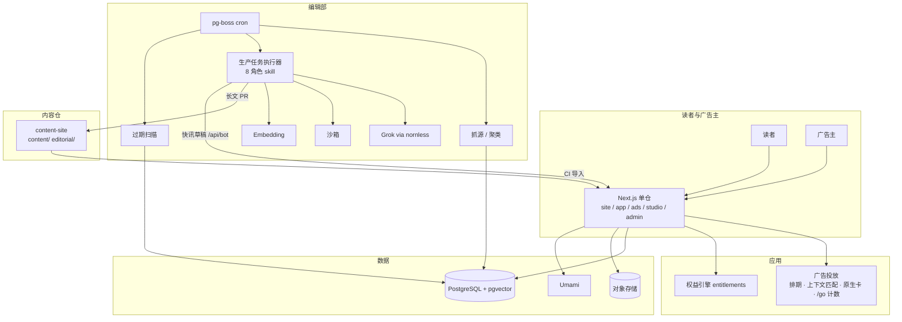

# 阶见 JieJian · 合并规划（免费为主 · 广告收入为主）

更新：2026-09-14
路径：`/Users/himma/01/01Agent学习/20-项目/aigc知识付费`
状态：**已定稿**（2026-09-14 16:00；第 15 节逐项有结论）
来源：`grok-export/阶见_AI知识操作系统与科技情报站_完整项目规划.docx`（Grok，2026-09-13，下称 **阶见稿**）+ `03-Grok写作与内容运营规划.md`（下称 **03**）+ `00` / `01` / `02`
性质：**合并后的唯一主文档**。2026-09-14 已执行定稿标注：`03` 与阶见稿转为参考、`02` 暂不采用、`00` 付费墙 / 单篇 / 专属章节废止、`01` 付费墙组件废止（各文文首有状态说明），`AGENTS.md` 已按本文与 `05` 重写。`01` 的视觉令牌与版式继续有效并按第 6.7 节补广告位。
补充（同日，用户定）：**广告模块预留、总开关默认关闭，先做用户体验。** 第 3 节的商业模式是长期目标；上线顺序、开关体系、推荐位关闭态、体验达标线与分级开启见 `05-产品推导-体验优先与广告开关.md`。本文 S3–S6、S11 在 `05` 中改称推荐位 R1–R5。
决议（2026-09-14 下午，用户定）：① **公众号暂不做**——日报主载体是站内早报页 + RSS，邮件早报可选、周报默认；本文所有「公众号」渠道与指标已按此改写。② **动手实验（`lab`）暂不做**——动手内容并入 `unit` 教程正文（步骤 + 成功标准 + 实测徽章）；`project` 保留为编辑内容；站内不做 UGC / 学生创作发布。③ **内容许可与抓取政策**按第 11 节执行（用户授权我定）。④ **不拆分范围**——全部模块都建，按第 13 节顺序，开关决定何时对读者可见；不再另切更小的 MVP。
拍板（2026-09-14 16:00，用户，第 15 节 12 项与 `05` 第 14 节 10 项全部有结论）：① 站名与域名 **`ai.nornless.com`**（nornless 子站，视觉沿 nornless；「阶见」只作文档内部代号，不对外）；② **境外起站，国内暂不办主体、暂不备案**；③ **收款走发卡站的会员码 / 广告码**（沿用中转站的 catfk 店铺，文中称「发卡站」），不接支付 SDK，不做收款码人工确认；④ 支持者 = **会员码制**，价格是发卡站商品配置；⑤ bot 起点 = **本机 Grok Build skill 开 PR + xAI API 接口**，不做对话手搬、不做 Cloud Agent；⑥ **内容开放或收费都是配置**——每篇 `access`，全局 `paywall.enabled` 默认关，开时按 `00` 的裁切规则；⑦ **五个广告专区全部规划建设、不分先后**；⑧ **测验暂不做**（`quiz.enabled` 关），单元完成靠「读完，下一课」标记；其余项按建议。状态由「提案，待拍板」改为 **已定稿**。
补（同日 16:30，用户定）：**后端用 Python**。功能与约束规格、角色矩阵、状态机总表、Python 架构见 `06-功能设计-对外与后台-Python后端.md`；本文 §9.2 的 Next.js / pg-boss / Drizzle 三行作废，§9.6 仓库结构以 `06` §8.10 为准。

---

## 0. 先说三件事

1. **阶见稿和 03 在产品和生产上高度一致，不冲突**：都是「阶梯 + 情报」两层共用一套图谱、Grok 后台起草、人审、事实核验、AI 披露、过时扫描、Next.js + PostgreSQL + pgvector。阶见稿在产品定义、层级细分、MVP 收敛、状态机、权益模型、增长闸门上更强；03 在编辑部角色隔离、机审十门、Git 落地形态、缺口探测、日报节律、与本仓现状衔接上更细。本文取两者之长。
2. **商业模式换轨**：两稿都是「订阅为主」（阶见稿明确写「不做展示广告堆满」）。本文按你的新要求改为 **内容基本免费、广告与赞助为主、低价支持者会员为辅**。这不是改一个价目表，它改变增长逻辑（流量业务）、内容默认访问（全免）、主体与备案的优先级（提前）、页面结构（广告位与广告专区）、后台（广告系统）和成功指标（受众规模与可售库存）。
3. **广告为主的代价要先认**：广告收入跟受众规模走，滞后流量 6–12 个月；程序化广告在中文内容站的单价很低，钱在直销赞助和自助专区；开发者受众拦截器使用率高，广告必须做成服务端渲染的原生卡。所以本文的路线图前半段收入接近零，靶子是**受众和可售库存**，不是收入。

---

## 1. 阶见稿 × 03 对比与裁决

| 维度 | 阶见稿 | 03 | 合并裁决 |
|---|---|---|---|
| 产品定义 | 「AI 知识操作系统 + 科技情报站」，Grok 是后台引擎不是前台人格 | 「AI 知识阶梯 + 每日简报」 | **采阶见稿**定义与定位句；首页主 CTA 用「测一测你卡在哪一层」 |
| 层级 | L0–L7 八层 DAG，横切主题 | L0–L5 六层 × 领域矩阵 | **八层为纵轴**（它补的正是选型、工作流、评测运维、失败案例四环），**03 的领域 / 岗位为横轴**，矩阵保留 |
| 内容单元 | 六零件（概念卡 / 实验 / 对照表 / 常见坑 / 测验 / 项目） | 八体裁（知识文 / 教程 / 案例 / 日报 / 周深度 / 评测 / 术语 / 资源） | 合并为一张**内容对象类型表**（第 4.4 节） |
| MVP 范围 | 只打透一条路径（文档问答）+ 20 概念卡 + 快讯 + 周报 | 首发 70 节点铺全层 | **采阶见稿收敛**：1 条完整路径证明阶梯；概念卡 / 术语 / 快讯做宽度（免费、便宜、吃搜索）；03 的 70 节点降为 backlog |
| 情报形态 | 快讯 / 早报 / 周报 / 深度 / 过时清单 五档 | 日报 / 周深度 / 专题 / 月报 | 采五档 + 03 的**专题页与时间线**作为页面（不是体裁） |
| 生产流水线 | 状态机 idea→…→published→needs_update；fact_claims；强制字段；Grok 只能在 Studio 里调 | 8 个 bot 角色；撰稿 / 核查隔离；十道机审门；Git 编辑部起步 | **状态机 + 事实清单 + 强制字段采阶见稿**；**角色隔离 + 十门 + 提示注入防护采 03**；落地形态：长文 Git PR 起步，快讯从第 1 个月起走站内审稿列表（Git 承受不了每周 40 条快讯的 PR） |
| 角色权限 | 前台 5 角色 + 后台 8 角色矩阵 | 主编一人 + bot | 保留阶见稿矩阵为**目标态**；当前一人时折叠（第 7 节）。「Author 不得自发布」对 bot 天然成立 |
| 商业模式 | Freemium + 计量 + Pro ¥39 / Plus ¥129 + 资产单卖；订阅 55–70% | 单篇 + 会员 + 分组 + 计量 | **全部改写**：内容免费，广告与赞助为主，支持者会员低价，见第 3 节。权益引擎（entitlements）保留，随时可把某类内容切回收费 |
| 付费墙 | 软墙、导语目录结论公开、90 天降级 | `<!-- more -->` 服务端裁切 | 内容墙基本不用；**服务墙**保留（下载、问答额度、去广告、会员 RSS）；裁切能力留着 |
| 主体与支付 | 海外主体 + Stripe 先行，V2 国内镜像 | 先境外起站、备案并行、收款码起步 | **已定**：境外起站，国内暂不办主体、暂不备案；收款全部走发卡站的会员码 / 广告码（沿用中转站店铺），站内只做兑码；海外直销广告主可 Stripe；主体与备案改为「有需要发票的直销广告主或广告月收入过阈值时再办」 |
| 技术栈 | Next.js + PG + pgvector + Redis/BullMQ + Meilisearch + Stripe + S3 | Next.js + PG + 单 worker | **一人版**：Next.js 单仓多路由组 + PG（FTS 起步）+ pg-boss 队列（免 Redis）+ S3 兼容存储 + Caddy/Compose；Meilisearch、Redis 量上来再加。文件夹边界按阶见稿画 |
| 缺口发现 | 缺口雷达 | 四信号（空格 / 悬空前置 / 无结果搜索 / 读者反馈） | 采 03 四信号，加阶见稿的「竞品已写我方未写」 |
| 过时机制 | Last-verified / expires_at / 月度过时清单 / 勘误赠月 | 复核日按类型 / 新闻触发保鲜 | 全采；过时清单是**产品**，勘误 SOP 是品牌 |
| 实体页 | 模型 / 公司 / 论文 / 工具永久 URL | 工具目录 | 采实体页；工具实体页同时是**黄页（广告专区）**的载体 |
| 站内问答 | 只答已审语料、段落引用、额度、降权 | 助教（02 H5）按权限 | 全采，放 V1 |
| 品牌 | 阶见 JieJian（备选路标 / 原栈 / 核稿） | 线框暂名「AIGC 知识库」 | **工作名阶见** |
| 视觉 | 杂志 + 文档站，浅色默认，软墙不弹窗 | `01` 书页变种 | **沿用 `01`**（已满足阶见稿原则），补广告卡与专区样式 |
| 路线图 | 0–3 / 3–9 / 9–18 月 + 闸门 | C/S 双线按周 | 采阶见稿三段 + 闸门；闸门改为**受众与库存**指标；03 的 C0「内容不等站」保留 |
| 编制成本 | 3 人 + 月成本表 | 一人 + 代理 | 一人 + 代理为现实；阶见稿编制为扩张目标 |

**阶见稿里要修正的几处**：邮件为主的分发在国内打开率低，而公众号暂不做（用户定），所以日报的主载体是**站内早报页 + RSS**，邮件早报只做可选订阅、周报默认，国内触达靠搜索与社媒分享卡；「Grok 只允许在 Studio 里被调用」起步期改为「凡进站的生成都要有 generation_log，Git PR 附日志文件即可」；模型价格按当日公开价，不写死；3 人编制与 Redis / Meilisearch 是目标态不是起点。

---

## 2. 定位与用户

### 2.1 一句话

**阶见：读者永远知道自己在 AI 的第几层、下一件该做什么、以及哪篇已经过时。** 全部内容免费读，靠垂直受众的广告与赞助养活编辑部。

对内：我们卖的是**受众的注意力和信任**给广告主，卖的是**路径、判断和可执行物**给读者。两边都靠同一件事：内容可信、有坐标、会更新。

### 2.2 双边用户

读者侧（阶见稿三层，保留）：

| 层 | 是谁 | 来站任务 | 对广告主的价值 |
|---|---|---|---|
| A 好奇 / 转行 | 大学生、转行者 | 搞懂名词、选第一条路 | 量大、单价低；课程 / 教育类广告主要的 |
| B 职场实干 | 产品 / 运营 / 分析，25–40 岁 | 本周任务少试错两周 | SaaS 工具、办公 AI、培训主要的 |
| C 工程师 / 小团队 | 独立开发者、技术负责人 | 可复现、成本账、架构取舍 | 云、API、向量库、IDE、招聘方最愿付高价的受众 |

广告主侧（新增）：

| 类 | 是谁 | 买什么 |
|---|---|---|
| AI 工具 / SaaS | 编码代理、工作流平台、知识库、生图视频工具 | 黄页认证与置顶、文章页原生卡、简报赞助、发布墙 |
| 基础设施 | 云、API 网关、向量库、GPU、模型厂 | L3–L7 页面的上下文投放、专题赞助、周报赞助 |
| 教育 / 培训 | 课程、训练营、高校项目 | L0–L2 页面、路径页、日报赞助 |
| 招聘方 | AI 相关岗位的公司 | 招聘板发布与置顶、周报「本周岗位」 |
| 自家 | 课程、资源包、（合规前提下）自家服务 | 填未售库存的 house ads，也用来测转化 |

### 2.3 不做

沿阶见稿：不做顶会全覆盖媒体、荐股币圈、医疗法律个案、无来源爆料、日更 50 篇长文的 SEO 农场、大广场社区、V1 原生 App。新增：**不做无标识软文、不接灰产广告、不做基于个人画像的定向投放、不做整页 / 弹窗 / 插屏广告。**

---

## 3. 商业模式：免费为主，广告为主

### 3.1 逻辑变化

| | 订阅为主（两稿原设） | 广告为主（本文） |
|---|---|---|
| 增长引擎 | 转化率、续费率 | **受众规模 × 受众质量 × 可售库存** |
| 内容默认 | 免费入口、付费进阶 | **全免费**，可读可抓取可分享 |
| 关键渠道 | 邮件 + 站 | 站 + RSS + 邮件 + 社媒卡片，全渠道打包卖（公众号暂不做） |
| 主体与备案 | 可先海外 | **国内主体与备案要早**（发票、联盟、流量主） |
| 页面 | 付费墙组件 | 广告位 + 广告专区 + 「广告 / 赞助」标识 |
| 后台 | 订单 / 会员 | + 广告位、广告主、排期、素材、审核、报表、发票 |
| 成功指标 | 付费用户、年付占比 | UV / 订阅数 / 售出率 / eCPM / 询盘 / 续约 |
| 风险 | 转化不动 | 流量爬坡慢、广告伤信任、拦截器、广告法 |

### 3.2 收入结构目标（12–18 个月）

| 优先级 | 来源 | 目标占比 | 说明 |
|---|---|---|---|
| P0 | **直销赞助** | 35–50% | 日报 / 周报赞助位、首页与文章页原生卡、专题赞助。单价最高，需要你花时间卖 |
| P0 | **自助广告专区** | 20–30% | 工具黄页认证 / 置顶、招聘板、发布墙 featured、活动位。自助下单，少销售 |
| P1 | 联盟 / CPS | 5–10% | 云、API、IDE、课程、书、硬件；文内必须披露 |
| P1 | 程序化广告 | 0–10% | 百度联盟等，只做列表页与专区的填充；备案后再接 |
| P1 | 支持者会员 | 10–15% | 低价，买的是去广告 + 便利 + 资源 + 支持 |
| P2 | 企业 / 定制 | 视机会 | 赞助专题、内训、班级 / 企业专区 |
| P3 | 内容授权 | 预留 | `llms.txt`、付费爬取协议 |

**硬约束**：单一广告主 ≤ 30% 月收入；每页广告位 ≤ 2；赞助不改变任何编辑结论。

### 3.3 广告产品清单（可售库存）

| 编号 | 产品 | 形态 | 每期 / 页数量 | 计价方式 | 阶段 |
|---|---|---|---|---|---|
| S1 | 日报赞助 | 日报顶部「本期由 X 支持」+ 2–3 句 + 链接（站内 + 邮件同步） | 1 | 按期固定价 | V1 |
| S2 | 周报赞助 | 周报一段 + 可选「本周岗位」3 条 | 1 | 按期固定价 | V1 |
| S3 | 首页「本周赞助」卡 | 原生卡 | 1 | 按周固定价 | MVP（house ads 起） |
| S4 | 文章页侧栏原生卡 | 目录下方 sticky，**按层级 / 领域上下文投放** | 1 | 按周 / 按 CPM | MVP |
| S5 | 文章末「相关工具」卡 | 原生卡，可联盟 | 1 | 按周 / CPS | MVP |
| S6 | 列表与专区卡片流插卡 | 每 8 张卡 1 张 | ≤ 1 / 屏 | 直销或程序化填充 | V1 |
| S7 | 黄页认证与置顶 | 「认证商家」徽章 + 分类页前 3 + 详情页增强（logo / 视频 / 优惠码） | 分类 3 | 按月自助 | MVP |
| S8 | 招聘板发布与置顶 | 岗位卡 30 天；置顶 7 天 | 不限 / 置顶 5 | 按条自助 | MVP |
| S9 | 发布墙 featured | 新产品 / 大版本发布卡，周榜 | 周 3 | 按周自助 | V1 |
| S10 | 活动与课程位 | 训练营 / 直播 / 线下 | 3 | 按周自助 | V1 |
| S11 | 专题赞助 | 一个专题页（如「RAG 落地」）+ 该专题下所有文章 S4 位 + 专题 banner | 每专题 1 | 按月固定价 | V1 末 |
| S12 | 优惠专页 | 联盟优惠码 | 不限 | CPS | V1 |

价格锚一律待实测，上线时**公开价目表**（透明比询价更利于自助）。首月全部位置用 house ads 与免费试投填满，收集 CTR 数据后再定价。

### 3.4 广告专区设计

专区是站内一块**清楚标识为商业区**的地方，读者知道这里的排序有付费成分；编辑区（阶梯、快讯、周报、评测）与之物理隔离、样式区分。

| 页面 | 职责 | 免费部分 | 付费部分 |
|---|---|---|---|
| `/tools` 工具与服务黄页 | 实体页 + 商业载体。分类、标签、国内可直连、价格、更新日志、实测徽章（编辑部给，不可买） | 基础挂牌（SEO） | 认证徽章、置顶、详情增强、优惠码 |
| `/jobs` 招聘板 | AI 相关岗位 | 浏览、订阅岗位邮件 | 发布、置顶、企业套餐 |
| `/launches` 发布墙 | 新产品 / 大版本发布，周榜进周报 | 基础提交 | featured、周榜标注 |
| `/events` 活动与课程 | 训练营、直播、线下 | 列表 | 置顶位 |
| `/deals` 优惠 | 联盟优惠码与返佣 | 全部 | （返佣） |
| `/sponsored` 赞助内容 | 厂商自述、案例（**标「推广」**，不进阶梯 / 搜索推荐 / 日报正文） | — | 按篇 |
| `/advertise` 媒体页 | 受众、数据（月更）、产品、公开价目、规则、案例、询盘与自助下单 | — | — |
| `/ads`（广告主后台） | 兑广告码开通、素材、审核状态、报表、收据、续费 | — | — |

**建设范围（用户 2026-09-14 定）**：五个专区 + 赞助内容 + 媒体页 + 广告主后台**全部规划、全部建设，不分先后**，MVP 期一起建成关闭态；对外开卖的顺序由 `05` §11.3 分级开启决定，不由建设顺序决定。每个专区的字段、流程、付费项、审核与到期规则见第 6.6 节。

**编辑部保留的不可购买项**：实测徽章、评测结论、对照表排序、阶梯正文推荐、过时清单、勘误。这些是受众信任的来源，也是广告值钱的原因。

### 3.5 广告规则（写进 `/about/ads-policy`）

- 每页 ≤ 2 个广告位；文章正文中间不插广告；不做弹窗、插屏、悬浮、自动播放。
- 所有广告位固定样式的**服务端渲染原生卡**：标题 ≤ 24 字、文案 ≤ 60 字、一张图或 logo、一个链接。不接受广告主脚本、像素、iframe。点击经 `/go/<id>` 跳转计数。
- 每张卡固定角标「广告」或「赞助」（《互联网广告管理办法》要求可识别）；联盟链接文末披露。
- **上下文定向，不做人群定向**：按层级、领域、标签、页面类型投放，不用个人画像，不追踪跨站。统计只聚合。
- 禁投：机场 / 破解 / 代刷 / 灰 Key 等灰产、荐股与代币、医疗、博彩、未持牌金融、政治、与本站编辑内容直接冲突的虚假宣传；广告文案不得出现《广告法》禁用的绝对化用语（最佳 / 第一 / 唯一 等），自助下单也人审。
- 编辑独立：赞助不换结论、不进阶梯正文、不影响过时清单；评测涉及的厂商在该评测页不投 S4 / S5。
- 支持者、有效班级 / 企业成员不看 S3–S6；S7–S10 是专区本身的排序，对所有人一致。
- 单一广告主 ≤ 30%。

### 3.6 轻付费层

| 形态 | 收款方式（已定：全部码制） | 价格锚（示意，发卡站商品可改） | 权益 |
|---|---|---|---|
| 支持者会员 | **会员码**：发卡站售卖（月 / 季 / 年 / 自定义天数），也可后台生成手发；站内 `/redeem` 兑码即时生效 | ¥9 / 月 · ¥69 / 年；学生免费 = 直接发码 | 站内与邮件版去广告、问答 20 次 / 日、资源包下载、会员 RSS、过时清单详情、早鸟活动、支持者致谢页、收费内容全文（若有） |
| 内容码（配置项） | 单篇 / 单路径 / 单资源的**内容码**，发卡站售卖 | ¥9–29 | 解锁对应 `access: code` 的内容或资源；支持者不需要 |
| 打赏 | 赞赏码 | 任意 | 文章末，零门槛 |
| 班级 / 企业专区（V2） | 批量会员码 + 分组 | 按组谈 | `00` 的分组模型改用途：去广告 + 资源 + 进度共享 + 专属路径 |

不接支付 SDK，不做「收款码 → 人工确认」流程：所有收款都发生在发卡站，站内只认码。续费 = 再买一张码再兑，天数累加。发卡站店铺页可在 `/pricing` 内嵌或跳转（沿中转站 `/recharge-shop` 做法，CSP `frame-src` 放行）。

**内容访问是配置，不是原则**（用户 2026-09-14 定）：每篇 front-matter `access: free | supporter | code | group`，默认 `free`；全局开关 `paywall.enabled` 默认关，关时全部按免费渲染并在 Studio 提示「有 N 篇标了收费但开关未开」。开时沿 `00` 的规则：服务端在 `<!-- more -->`（缺省前 30%）处截断，未授权部分不进 HTML / JSON，截断处放解锁卡（会员码 / 内容码）；`group` 专属对无权用户 404、列表不出现；收费内容列表卡标「会员」，JSON-LD `isAccessibleForFree: false`。起步态全部免费。

### 3.7 经济账（公式与示意，不是预测）

驱动项：

```text
直销赞助   = Σ(位置 × 售出期数 × 期价)         期价随 可售受众（订阅 + 粉丝 + UV）与受众质量走
自助专区   = Σ(挂牌数 × 单价)                   随站在圈内的知名度走，不直接随 PV
联盟       = 点击 × 转化率 × 佣金
程序化     = PV × 位数 × 填充率 × eCPM / 1000    中文内容站 eCPM 低，只当填充
支持者     = 支持者数 × 月价
```

示意情景（全部是假设，用来设闸门，不用来做预算）：

| 阶段 | 受众假设 | 可能卖出什么 | 广告收入量级 / 月 |
|---|---|---|---|
| 第 3 月 | 月 UV 2 万，邮件 1–2k，RSS 订阅可见增长 | house ads、零星自助挂牌、首个赞助询盘 | ¥0–2k |
| 第 9 月 | 月 UV 10–15 万，邮件 1.5 万 | 日报赞助部分售出、周报赞助、招聘 10–20 条、置顶若干、联盟 | ¥1–3 万（售出率 50% 左右） |
| 第 18 月 | 月 UV 50 万，邮件 5 万 | 位置基本售满、专题赞助、企业专区 | ¥5–10 万 |

成本侧（阶见稿估算 + 邮件放量）：模型 API ¥500–3,000 / 月；托管 + CDN + DB ¥200–800；广播邮件随订户线性增长（万级日报订户每月数十万封，国内送达与打开都弱，**日报主载体是站内页 + RSS，邮件早报做可选、周报默认**，广播成本按实际订户盯）；主体与备案一次性；人力是大头。

**结论**：前 6 个月广告收入不可能覆盖时间成本，靶子只能是受众与库存；第 9 月的闸门是「广告月收入 ≥ 模型 + 托管 + 邮件」。

### 3.8 主体、备案与广告生态

| 需要 | 为什么 | 何时（用户 2026-09-14 定） |
|---|---|---|
| 境外起站 | 域名 `ai.nornless.com`（nornless.com DNS 在 Cloudflare）；独立 VPS + Docker Compose + Caddy；不上中转站 65 / 87 的 Caddy；境外 CDN | MVP 起 |
| 收款 | 发卡站（沿用中转站 catfk 店铺）售会员码 / 内容码 / 广告码，站内兑码；无 SDK、无人工确认 | MVP 起 |
| 国内主体（个体户 / 公司） | 直销赞助要发票；百度联盟等要主体；微信 / 支付宝商户 | **暂不办**。触发条件：出现需要发票的直销广告主，或广告月收入连续 3 个月 ≥ 运行成本 |
| ICP + 公安备案 | 国内主机、百度联盟、微信 H5 支付 | **暂不做**。与主体同一触发条件；办下来再切国内 CDN |
| 公众号 | **暂不做**。将来若开：流量主门槛低（以当前规则为准），接草稿箱接口需认证 | 待定 |
| Stripe | 海外直销广告主付款 | 有需求再开 |
| Google AdSense | 大陆用户基本加载不出来，只对海外访客有意义 | 不优先 |

没有主体的代价要写进媒体页：暂不开发票、不接联盟、不接微信 / 支付宝商户；自助广告全部码制，直销赞助按广告主情况用对公 / Stripe。

---

## 4. 内容体系

### 4.1 八层 × 领域

纵轴八层（阶见稿），每层回答一个问题，**默认全免费**：

| 层 | 名称 | 走完应会什么 | 典型零件 |
|---|---|---|---|
| L0 | 方向与边界 | AI 能做什么不能做什么；该不该学；学哪条岗位路径 | 能力边界、岗位地图、谣言澄清、选路测评 |
| L1 | 常识与工具素养 | 模型 / Token / 幻觉 / 上下文；会安全对话；会评价一次回答 | 概念卡、提示词基础、隐私与账号安全、Prompt 评价迭代 |
| L2 | 选型与成本 | 云端 / 本地、产品 / API、模型之间做决策树，估得出账单 | 工具矩阵、模型对照、账单案例 |
| L3 | 搭建 | 从 0 搭最小可用系统：API、编辑器、本地模型、入门 RAG、自动化 | Hello World、Ollama、Dify / n8n、Cursor / CC / Codex |
| L4 | 工作流与 Agent | 单次对话升级成可重复工作流；MCP、失败恢复、评测直觉 | Agent 入门、工具调用、评测清单、权限 / 版本 / 回滚 |
| L5 | 应用与场景 | 按岗位 / 行业做出可交差的结果，写得出失败原因 | 客服知识库、周报流水线、AIGC 生产线、教育场景 |
| L6 | 工程化 | 评测、监控、控成本、护栏、部署、安全事件 | Eval、路由、可观测、安全 |
| L7 | 原理与前沿 | 读懂官方技术报告关键段，判断新在哪旧在哪 | Transformer 直觉、训练 / 推理 / 对齐、论文速读 |

横切主题（每篇的必选模块，不是栏目）：安全合规、失败案例、成本账。

横轴领域 / 岗位（03）：通用认知 · 办公与学习 · 开发与 Agent · AIGC 创作 · 行业与岗位（客服 / 研报 / 销售 / 教师 / 法务 / 制造）· 原理与研究。**每个内容节点 = 一层 × 一领域**，缺口 = 空格或悬空前置。

03 的 70 节点重映射：原 L0 → L0/L1；原 L1 → L1；原 L2 → L2/L3；原 L3 → L4/L5/L6；原 L4/L5 → L7。它们是 backlog，不是首发清单。

### 4.2 首发只打透一条路径：从 0 做一个文档问答

阶见稿的判断成立：三个月内铺八层等于八层都薄。一条覆盖 L0–L7 的路径既证明阶梯，又天然产出资产包和实体页。

| 序 | 单元 | 层 | 读完交付 |
|---|---|---|---|
| 0 | 你是不是真的需要一个知识库 | L0 | 做 / 不做决策表 |
| 1 | 文档问答到底怎么工作（直觉版） | L1 | 能向同事讲清检索 + 生成 |
| 2 | 选产品还是自建，选哪家模型 | L2 | 决策树 + 月费估算表 |
| 3 | 准备语料：切分、清洗、权限 | L3 | 语料规范 |
| 4 | 最小 RAG：从文件夹到能提问 | L3 | 可运行最小项目（沙箱实测） |
| 5 | 为什么它会答错，怎样评测 | L4/L6 | 20 条金标问题 + 评分表 |
| 6 | 加引用、拒答、权限和日志 | L6 | 上线检查单（首个资源包） |
| 7 | 做成工作流：定时更新语料 | L4 | n8n / 脚本模板 |
| 8 | 何时不该上 Agent | L4 | 判断清单 |
| 9 | 原理回看：检索、嵌入、幻觉从哪来 | L7 | 能读懂一篇 RAG 论文摘要 |

宽度由**概念卡 + 术语 + 实体页 + 快讯**提供：MVP 概念卡 40 张优先补 L0–L2，术语随文生成，实体页随快讯生成。

### 4.3 情报线五档 + 两种页面

| 形态 | 长度 / 节奏 | 内容 | 广告位 |
|---|---|---|---|
| 快讯 | 200–400 字，工作日 8–15 条 | 标题 + 3 点事实结论 + 来源（双源或官方一手）+ 挂接节点 + 「对谁有用」 | 无 |
| 早报（日报） | 每个工作日 | 快讯汇编 + 今日行动项 + 关联知识文；站 + RSS + 邮件（可选） | S1 |
| 周报 | 每周固定日 | 重要 / 不重要 / 被高估 三栏 + 深度 1 则 + 本周岗位 3 条 + 本周过时 | S2 |
| 深度拆解 | 3–6 千字，每周 1–2 | 发生了什么 → 为什么重要 → 对读者意味着什么 → 怎么做；判断段人写 | S4/S5 |
| 过时清单 | 每月 | 本月作废 N 篇：原因、替代节点、迁移步骤 | 无 |
| 专题页 | 事件驱动 | 事件时间线 + 所有相关文 + 相关实体 | S11 |
| 时间线 / 谱系 | 常青 | AI 大事时间线、模型谱系 | S4 |

快讯必须能挂到节点上，挂不上的不发。来源三级（官方 / 二手 / 社媒）与打分规则沿 03 第 2.3 节；X 检索是 Grok 的独有线索源，只当线索不当事实。

### 4.4 内容对象类型（合并六零件与八体裁）

| 类型 `kind` | 结构 | 字数 | 默认访问 |
|---|---|---|---|
| `concept` 概念卡 | 定义 / 类比 / 反例 / 前置 / 下一步，一张图或对照 | 800–1500 | F |
| `unit` 路径单元 | 读完你能… → 正文 → 练习与成功标准 → 小结 → 下一步 → 来源 | 2000–4000 | F |
| `lab` 动手实验 | **暂不做**（用户 2026-09-14 定）。动手内容并入 `unit` 教程正文：环境与前置 → 步骤（每步可验证）→ 成功标准 → 常见失败；类型保留不启用 | — | — |
| `compare` 对照表 | 结论先行 → 表 → 逐项 → 适合谁 → 截至日期 | 1500–3000 | F（CSV 可 supporter） |
| `pitfall` 常见坑 | 现象 → 原因 → 修法 → 何时会再犯 | 800–1500 | F |
| `quiz` 测验 | **暂不做**（用户 2026-09-14 定）；类型保留不启用。单元完成靠「读完，下一课」标记 | — | — |
| `project` 项目 | 作品集级交付：目标 → 分步 → 验收 → 仓库 | 不限 | F（仓库 supporter） |
| `case` 案例 | 背景 / 工具 / 提示词 / 产出 / 复盘 | 1500–3000 | F |
| `news` 快讯 | 见 4.3 | 200–400 | F |
| `issue` 早报 / 周报 / 深度 / 过时清单 | 见 4.3 | — | F（会员 RSS 无赞助段） |
| `entity` 实体页 | 模型 / 公司 / 工具 / 论文：简介、变更日志、相关文、相关快讯 | 不限 | F |
| `glossary` 术语 | 一句话 / 一段 / 例子 / 相关文，中英对照 | 150–400 | F |
| `asset` 资产 | 用途 → 内容 → 用法 → 下载 | — | supporter 或低价单卖 |
| `listing` 商业条目 | 黄页 / 招聘 / 发布 / 活动 / 优惠（专区对象，不进阶梯） | — | 专区规则 |

### 4.5 缺口探测五信号

矩阵空格、悬空前置、站内搜索无结果词、读者信号（「没看懂」段落、问答未覆盖）、**竞品已写我方未写**（选题员每周扫）。全部落成生产任务，后台覆盖热力图。

### 4.6 生产配额（防农场）

| 类型 | MVP 每周 | 闸门 | 禁止 |
|---|---|---|---|
| 概念卡 | 4–6 | 前置节点 + 一张图或对照 | 写成综述 |
| 路径单元 | 1–2 | 练习 + 成功标准 | 只讲不练 |
| 快讯 | 40–70 | 双源或官方一手，3 点结论 | 改写通稿凑数 |
| 早报 | 5 | 固定版式，限时发出 | 写成博客 |
| 周报 | 1 | 三栏判断人写 | 堆链接 |
| 深度 | 1 | 材料包先于草稿 | 无来源观点 |
| 实体页 | 随快讯 | 有官方链接 | 抄官网 |
| 资产 | 1 包 / 月 | 与过时清单一起发 | 只在群里丢文件 |

### 4.7 存量素材的用法

沿 03 第 2.8 节：三份原理文合并为 L7 读本；CC / Codex / CLI / Harness 文剥掉机场、破解、灰 Key、网关名后重写进 L3–L4；大学课抽 L0–L1 免费卡；纪要与对话只作背景。

---

## 5. 站点地图

顶栏 ≤ 7 项：**学习 · 情报 · 工具 · 百科 · 招聘 · 搜索 · 登录**（支持者入口放页脚与账户，不占顶栏）。

```text
公开站
/                         选路测评 CTA · 今日简报 5 条 · 路径缩略 · 工具周榜 · 招聘精选 3 · 本周赞助卡(S3) · 最新概念卡
/learn                    8 层 × 领域 DAG 可视化；层 / 岗位筛选；锁节点显示「差什么前置」（登录后显示完成度）
/learn/[track]            一条路径大纲
/learn/[track]/[unit]     单元容器：文章（含动手步骤）+ 「读完，下一课」
/articles/[slug]          主阅读器（第 6.2 节强制模块 + S4/S5）
/news  /news/[slug]       快讯流 · 快讯页
/digest/daily/[date]      早报（S1）
/digest/weekly/[slug]     周报（S2）
/digest/deep/[slug]       深度拆解
/digest/outdated/[month]  过时清单
/topics/[cluster]         专题支柱页（S11）
/timeline                 大事时间线
/glossary  /glossary/[term]
/models/[slug] /companies/[slug] /papers/[id]   实体页
/tools  /tools/[slug]     黄页（S7）；实体页与商业条目同页不同区
/compare/[pair]           对照页
/jobs  /jobs/[id]         招聘板（S8）
/launches                 发布墙（S9）
/events                   活动与课程（S10）
/deals                    优惠与联盟
/sponsored/[slug]         赞助内容（标「推广」，noindex 可选）
/projects/[slug]          项目课
/search                   混合检索，分栏
/pricing                  支持者（含发卡站入口）
/redeem                   兑码（会员码 / 内容码；广告码在 /ads 兑）
/advertise                媒体页 + 询盘 + 自助入口
/about /disclosure /ads-policy /license /privacy /errata /changelog /authors/[id]
/rss.xml /rss/[section].xml /sitemap.xml /llms.txt

会员区 /app
/app                      学习台：继续学习、今日 3 任务、简报、问答余额、过时提醒
/app/path  /app/library  /app/downloads  /app/ask  /app/briefing  /app/account

广告主 /ads
/ads                      我的投放、报表
/ads/new                  选产品 → 素材 → 支付 → 审核
/ads/[campaign]           状态、曝光 / 点击、续费
/ads/billing              兑码记录 / 收据（暂无发票）

创作 /studio
/studio                   选题池（趋势 / 缺口 / 失效 / 竞品）
/studio/briefs  /studio/generate  /studio/facts  /studio/editor
/studio/review            审校队列（快讯批量审稿列表优先）
/studio/schedule  /studio/refresh  /studio/analytics

管理 /admin
用户与权益 · 支持者 · 码（会员 / 内容 / 广告，批量生成与对账） · 付费墙开关与收费内容清单 · 广告位 / 广告主 / 排期 / 审核 / 报表 / 收据 · 专区条目审核 · DAG 维护 · 新闻源 · 提示词版本 · 模型成本 · SEO 重定向 · 功能开关 · 审计
```

---

## 6. 页面级功能

### 6.1 首页

主 CTA「测一测你卡在哪一层」（2 分钟：目标 / 当前工具 / 每周时间 / 岗位 → 一条路径的某单元 + 「先不要学什么」）。次 CTA 订阅早报（邮箱 / RSS）。今日简报 5 条带层徽章。登录态「从这里继续」。工具周榜（黄页导流）。招聘精选 3 条（专区导流）。S3 一张。**没有聊天框。**

### 6.2 文章页强制模块（缺一不发）

层徽章 + 路径坐标（L3 搭建 · 文档问答 · 第 4/10）→ 标题 → 元信息（作者 / 时长 / 发布 / Last-verified）→ 「读完你能做什么」→ 目录 → 导语（解决什么、不解决什么）→ 正文（横切模块：安全 / 失败 / 成本）→ 结论 → 练习或下一步 → 来源卡（官方 / 论文 / 新闻 / 本站旧文，可点）→ **AI 披露**（模型、辅助比例、核验人、实测环境）→ 勘误入口与变更记录 → 上一课 / 下一课 / 相关快讯 / 相关概念 → S5 → 收藏、划线、引用复制、三键反馈（有用 / 没看懂 / 过时了）→ 赞赏。侧栏：目录 → S4（支持者不显示）→ 「问这篇」入口（V1）。结构化数据 `Article` / `NewsArticle` / `Breadcrumb` / `FAQ`。

### 6.3 学习台与测评

测评只问目标、工具、时间、岗位。学习台每日最多 3 个任务。不做掌握度（测验暂不做）；进度是书签，「读完，下一课」是唯一完成标记，不评分不排名。

### 6.4 搜索与推荐

分栏：概念、路径单元、快讯、工具、实体、资产。语义检索只走已发布已审语料。推荐 = 相关 × 未读 × 前置已完成 × 未过时；未登录只按层与热度。专区条目不进编辑推荐。

### 6.5 站内问答（V1）

只答本站已审语料，段落级引用，语料外答「本站还没写过，已记入选题缺口」。额度：访客 0 / 注册 3 / 支持者 20 / 班级按组。不做首页入口。

### 6.6 广告专区功能

- 黄页：挂牌（免费，需官方链接与可核实主体）→ 编辑部实测徽章（不可买）→ 认证 / 置顶 / 详情增强（自助付费）→ 优惠码 → 变更日志（可由快讯自动写入）。
- 招聘板：发布（岗位 / 公司 / 薪资范围 / 远程 / 链接）→ 审核 → 上线 30 天 → 置顶 7 天 → 到期提醒；岗位邮件 / 周报「本周岗位」。
- 发布墙：提交 → 审核 → 上墙 → 周榜（按编辑评分 + 点击，featured 只标注不改排序）。
- 活动与课程：提交（名称 / 主办 / 形式 线上 线下 / 时间 / 价格 / 报名链接）→ 审核 → 列表按时间排 → 置顶位（付费，≤ 2 个）→ 过期自动归档；周报「本周活动」一栏。
- 优惠：条目 = 实体 + 优惠码 + 联盟链接 + 有效期 + 披露文案；全部免费展示，收入来自返佣；`/go/<id>` 计数；过期自动下线；不做比价。
- 赞助内容 `/sponsored`：厂商自述与案例，按篇；固定「推广」角标；不进阶梯 / 搜索推荐 / 日报正文 / RSS 主源；有独立 RSS；审核清单与广告同。
- 自助开通流程（全部码制）：在 `/advertise` 选产品 → 跳发卡站买对应**广告码**（认证 30 天 / 置顶 7 天 / 招聘 30 天 / featured / 活动置顶 / 赞助文 1 篇…）→ 回 `/ads` 兑码 → 填素材（固定字段）→ 人审 ≤ 24h（合规清单）→ 上线 → 周报表邮件 → 到期 7 天提醒（再买码续）。无人工收款确认。
- 直销流程：`/advertise` 询盘 → 报价 → 排期锁位 → 收款（对公 / Stripe；暂不开发票，媒体页写明）→ 素材 → 上线 → 报表 → 续约。
- 投放引擎：按位置取有效排期；上下文匹配（层 / 领域 / 标签）；同页去重；频次不做人群级，只做会话级（同一会话同位置不连续三次同一广告主）；无排期时 house ads。
- 统计：曝光（服务端渲染即计，去爬虫）、点击（`/go/<id>` 302）、CTR、按天聚合；邮件版点击单独计；对广告主只出聚合数。
- 媒体页：受众定义、月更数据（Umami 聚合 + 订阅数）、产品与公开价、规则、案例、询盘表单、自助入口。

### 6.7 视觉补充（接 `01`）

- 语义色改一处：**金 = 价值与支持者**（付费墙退场），**靛蓝极光 = 分组 / 归属**，**中性 = 免费**，新增 **赞助卡 = `--paper-soft` 底 + 1px `--line` 描边 + kicker「赞助」/「广告」**，不用金线、不用 featured 顶线；专区列表卡右上角固定角标。
- 广告位尺寸：S3 / S4 / S5 统一 280 宽原生卡（图 16:9 或 logo 1:1 ≤ 64px、标题、文案、按钮文字 ≤ 6 字）；S6 与列表卡同尺寸加角标；S1 / S2 是文字段落 + 小 logo。
- 移动端：S4 落到正文末 S5 之上，合并为 1 张；吸底购买条改为吸底「订阅早报」条（仅首页与快讯页）。

### 6.8 明确不做

V1 不做即时通讯、动态流、积分商城、直播、短视频流、UGC 长文主场、「一键生成发布到全网」矩阵工具、复杂积分。广告侧不做弹窗 / 插屏 / 悬浮 / 自动播放、人群定向、第三方脚本、无标识软文。

---

## 7. 角色与权限

### 7.1 目标态（阶见稿矩阵）

前台：Guest / Free / Supporter / GroupMember / **Advertiser**。后台：Author / FactChecker / Editor / Publisher / **AdOps** / Ops / Finance / Admin / Super。财务与内容权限永不绑同一日常账号；广告审核（AdOps）与编辑（Editor）分开，一人兼任时也分开登录。

### 7.2 当前一人折叠

| 目标态角色 | 现在谁 |
|---|---|
| Author | bot 撰稿员（不能发布，天然满足「Author 禁自发布」） |
| FactChecker | bot 核查员机审 + 主编对快讯 3 点结论与来源抽检签字 |
| Editor / Publisher | 主编（你） |
| AdOps | 主编，另一个账号 |
| Finance | 主编 |

招到兼职作者或分发运营时按 7.1 拆。

### 7.3 权益规则（唯一真源，仍只在一处算）

```text
可见(用户, 内容)                    → access ∈ {free, supporter, code} → 是；access = group → 有效组成员 → 是，否则 否（404、列表不出现）
能读全文(用户, 内容)                → paywall.enabled 关 → 是；access = free → 是；supporter → 有效支持者或组权益；code → 已兑该内容码或有效支持者；group → 组成员
                                      否则 → 只给 <!-- more --> 之前的预览（缺省 30%），服务端截断
能下载(用户, 资产)                  → 资产 free → 是；supporter 资产 → 有效支持者或组权益 → 是；否则 否
问答额度(用户)                      → 访客 0 · 注册 3/日 · 支持者 20/日 · 组按组设
看广告(用户, 位置)                  → 支持者 / 有效组成员 且 位置 ∈ {S3..S6} → 否；否则 是
专区权益(广告主, 条目)              → 有效订单期内 → 是
发布(角色)                          → 仅 Publisher 及以上；bot 无
改事实清单(角色)                    → FactChecker / Editor / Publisher
广告上线(角色)                      → 仅 AdOps 及以上，且通过合规清单
```

权益查 `entitlements`，不查套餐名字符串。

---

## 8. Grok 编辑部流水线

### 8.1 原则

流水线提高的是**可发布率和可追溯性**，不是字数。每一篇正式内容是一个对象，带状态、来源、成本、责任人。凡进站的生成都要有 `generation_log`（模型、prompt 哈希、tokens、成本、检索文档、延迟）；Git PR 形态下日志文件随 PR 提交。Grok 是默认引擎不是架构中心，prompt 与 schema 不绑死模型名。

### 8.2 状态机

```text
idea → assigned → researching → drafting → machine_qa → factcheck → editing → legal(按需)
     → scheduled → published → needs_update → archived
```

任何回退写原因。`published` 不是终态：过期扫描与新闻触发可打回 `needs_update`。`machine_qa` 是 03 的十道门，放在事实核验之前，机器先筛。

### 8.3 角色与状态的对应

| bot 角色（03） | 负责的状态 | 模型 | 说明 |
|---|---|---|---|
| 选题员 | idea → assigned | grok-4.6 | 五信号 + 新闻聚类 → brief |
| 研究员 | researching | grok-4.6（网页 + X） | 只读只摘，**不带写 / 执行工具**；输出分级事实清单 |
| 撰稿员 | drafting | grok-4.6 | 只读研究员的事实清单，不读原网页；按模板与层级约束出 CMS JSON |
| 核查员 | machine_qa / factcheck 辅助 | grok-4.6 新会话 | 与撰稿员不共享上下文；对着事实清单逐条核 |
| 验证员 | machine_qa（代码门） | grok-build-0.1 | 一次性沙箱真跑；回填实测记录；跑不通标「未运行」 |
| 排版员 | editing 辅助 | grok-4.6 + grok-imagine | 目录、callout、术语链接、内链建议、封面、OG 图 |
| 保鲜员 | needs_update | grok-4.6 | 复核日或触发式，产出 diff 与过时清单候选 |
| 简报员 | 快讯 / 早报 / 周报草稿 | grok-4.6 | 归并压缩，不加未出现的新闻，不做独家判断 |

### 8.4 按类型分流的 SOP 与 SLA

| 类型 | 流程 | SLA | 人做什么 |
|---|---|---|---|
| 快讯 | 抓源 → 聚类 → 材料包（官方 / 双源）→ 简报员 200–400 字 + 3 点 + 候选节点 → 机审 → **批量审稿列表** 3 分钟 / 条 → 发布 | 事件后 2 小时 | 核 3 点与来源、定节点 |
| 早报 | 当日快讯汇编 → 行动项 → S1 位素材 → 审 15 分钟 → 站 + RSS + 邮件 | 工作日 08:00 | 删改顺序、确认关联文 |
| 概念卡 | 缺口出题 → 检索本站旧文 + 白名单源 → 模板生成 → 机审 → 事实清单 → 终审 | 48 小时 | 终审品味与立场 |
| 路径单元 | **人先写学习目标与练习** → bot 按节展开 → 验证员跑代码 → 机审 → 事实清单 → 终审 | 1 周 / 单元 | 目标、练习标准、终审 |
| 深度 | 人选题 → 多源材料包 → 起草 → 对抗式核验（假设每句都错）→ **判断段人重写** | 3–5 天 | 判断段 |
| 周报 | 快讯归并 → 三栏草稿 → 主编改判断 → 本周岗位 3 条（招聘板）→ S2 → 发 | 固定窗口 | 三栏判断 |
| 过时清单 | 扫 Last-verified 与实体变更 → 候选 → 编辑确认作废 / 回写 / 降级 | 每月 | 处决权在人 |
| 实体页 | 快讯触发 → 生成 / 更新 → 机审 | 随快讯 | 抽检 |

### 8.5 发布强制字段

`title, slug, kind, level, domain, node_ids[], prereqs[], next[], sources[](tier), ai.generated, ai.model, ai.assist_ratio, ai.prompt_version, factcheck_status, reviewer_id, publisher_id, published_at, last_verified_at, review_by, expires_at, access, ad_context(tags 供上下文投放), changelog[]`。缺一个发布按钮不亮。完整 front-matter 见附录 D。

### 8.6 机审十门 + 事实清单

十门沿 03 第 3.6 节：结构、事实、代码、术语、重复、红线、可读、标识、版权、内链。全过进 `factcheck`：每条声明 `fact_claims` 状态 通过 / 存疑 / 删除，**未 100% 处理不能提审**。新闻类必须 FactChecker 签字（现在是主编抽检签字）。

### 8.7 调用规范与红线

- 系统提示版本化在 `/admin/prompts`，每次记录 `prompt_hash`。
- RAG 只检索已发布已审语料 + 白名单源；禁未审草稿与随机网页。
- 输出是 CMS JSON schema（`title, excerpt, outline, sections[], claims[], source_spans[], next_node, quiz[]`），禁直接吐 HTML。
- 温度：快讯 0.2，解释文 0.4，评论草稿 0.6；评论草稿不得直接上线。
- 模型路由：快讯与摘要用便宜快模型；单元与深度用旗舰；代码用代码模型。成本按篇 / 类型可看；日预算超限自动降级并告知，不默默降质。
- 红线：医疗 / 法律 / 投资默认拒写；未核验数字与「第一 / 唯一 / 最佳」拦截；代码跑通或标「未运行」；新闻双源或官方一手；不把未公开的用户问答原文写进文章；机场 / 灰 Key / 网关站名不进任何编辑内容。
- 安全：来源即不可信输入（提示注入）；研究员无写 / 执行工具；沙箱一次性、白名单出网、无凭据；bot 令牌只能写草稿、传资产、读大纲与反馈。

### 8.8 文风

具体、可证伪、先判断再解释。禁「在当今快速发展的人工智能时代」「赋能」「打造闭环」「重磅」。比喻最多一个。列表不是文章。国内可直连方案优先，海外标注不教翻墙。术语首次出现中英对照 + 一句解释并链术语卡。数字与价格带「截至 YYYY-MM-DD」。判断段人写。

### 8.9 落地形态

| 形态 | 用于 | 何时 |
|---|---|---|
| **Git 编辑部**：bot 写 `content/` 开 PR，PR 附 `generation_log.json` 与机审报告，合并即发布（CI 导入） | 概念卡、单元、深度、实体页 | 第 1 周起 |
| **站内审稿列表 v0**：服务器 cron 抓源 → 聚类 → 简报员 → 机审 → `/studio/review` 列表批量通过 | 快讯、早报 | 第 1–2 个月内必须有（每周 40+ 条快讯不能走 PR） |
| **Studio v1**：完整状态机、brief、生成台、事实清单台、编辑器 diff、排期、刷新、分析 | 全部 | V1 |

三种形态同一份 schema、模板、十门。bot 触发方式（用户 2026-09-14 定）：**长文走本机 Grok Build skill 开 PR**（skill 里带模板、schema、十门自检，产出 `generation_log.json`）；**快讯、早报与 Studio 内生成走 xAI API 接口**（队列任务调用——Python 版为 Procrastinate，见 `06` §8.5；同一份提示词版本与日志表）。不做 Grok Bot 对话手搬，不做 Cloud Agent。

### 8.10 日报的一天（国内渠道优先）

```text
06:00 抓源 → 06:30 聚类打分 → 07:00 简报员出快讯与早报草稿 → 07:15 机审
07:30 手机上审稿列表 15 分钟 → 08:00 站 + RSS + 邮件发布
当天  涉及模型发布 / 价格 / 改版 / 政策的快讯 → 关联知识文进保鲜队列；相关实体页更新
周一  周报选题 30 分钟；周三 单元或概念卡提审日；周五 周报终审 + 资产热修；月末 过时清单 + 退订 / 拦截率回顾
```

---

## 9. 技术架构

### 9.1 原则

内容对象优先；权益优先于套餐；生成与发布隔离（worker 只写草稿）；搜索与正文同源（向量库只同步已发布已审）；模型可替换；**广告投放服务端渲染、无第三方脚本**；一个人维护得动。

### 9.2 一人版技术栈

> **2026-09-14 16:30 起本表的应用 / 队列 / worker 三行作废**：用户定案后端 Python，改为 Django 5 + 模板 SSR + HTMX、Django Ninja 机器接口、Procrastinate 队列、`uv` 工具链，见 `06-功能设计-对外与后台-Python后端.md` §0.1 与 §8。其余行（数据库、存储、模型、Embedding、沙箱、统计、邮件、支付、部署、观测）不变。

| 层 | 选择 | 说明 |
|---|---|---|
| 应用 | Next.js App Router + TypeScript，单仓；路由组 `(site)` `(app)` `(ads)` `(studio)` `(admin)` | 阶见稿的 apps/* 边界先用文件夹与路由组画出来，人多再拆 |
| 数据库 | PostgreSQL + pgvector；全文检索先 `zhparser` 或 `pg_trgm` | Meilisearch 量上来再加 |
| 队列 | `pg-boss`（Postgres 任务表） | 免 Redis；生成、采集、扫描、邮件、报表都走它 |
| worker | 独立 Node 进程 `worker/` | cron + 任务执行 + 沙箱调用 |
| 存储 | S3 兼容（R2 或国内 OSS） | 资产、封面、仓库 zip、广告素材 |
| 模型 | Grok via nornless `/v1/responses`（grok-4.6 / grok-build-0.1 / grok-imagine），配置化可换 | 见 [[中转站]] |
| Embedding | 任一兼容模型或本地 bge-m3 | 查重、聚类、语义搜索 |
| 沙箱 | Docker 一次性容器 | 验证员 |
| 统计 | 自托管 Umami（或 Plausible） | 隐私友好，媒体页数据源 |
| 邮件 | 事务邮件与广播分开；广播选国内送达可用的服务，域名做 SPF / DKIM / DMARC | 收据走事务，早报 / 周报走广播 |
| 支付 | 全部码制：发卡站（catfk，沿中转站店铺）售会员码 / 内容码 / 广告码，站内 `/redeem` 与 `/ads` 兑码；海外直销广告主 Stripe；无 SDK、无人工确认 | 不自研支付核心；码表对账靠发卡站导出 |
| 部署 | 独立 VPS + Docker Compose（`web` + `worker` + `pg` + `umami` + `caddy`） | **不上 87 的 Caddy** |
| 观测 | 错误追踪 + 成本看板 + 生成日志 | 生成任务按篇查成本 |

### 9.3 逻辑架构



### 9.4 数据模型（合并）

```text
身份与权益
users, memberships(supporter), entitlements(user_id, feature_key, expire_at, source), groups, group_members, group_rules(用途改为 去广告/资源/进度), codes(kind: supporter|content|asset|ad_product, sku, duration_days, target_id, batch, issued_via: shop|manual, redeemed_by, redeemed_at), content_unlocks(user_id, node_id, source), orders(保留给直销), audit_logs, feature_flags(key, value, changed_by, changed_at)

内容图谱
levels, domains, topics(节点, 覆盖状态), content_nodes(kind, level, domain, status, body, excerpt, published_at, last_verified_at, review_by, expires_at, access, ad_context, ai_*), node_edges(prereq|next|related|news_of|implements|entity_of), entities(model|company|tool|paper), paths, path_items, glossary_terms, assets, changelog

生产
sources(tier), source_items(cluster_id, score, embedding), clusters, news_events, production_tasks(kind, origin, model, prompt_version, tokens, cost), task_steps(role), drafts(qa_report), fact_claims(claim, status, checker_id), reviews(decision, checklist), generation_jobs(prompt_hash, retrieved_doc_ids, latency), content_reviews(trigger), prompts(version)

读者
progress, bookmarks, feedback(helpful|confusing|outdated, anchor), questions/ask_threads(citations, tokens, cost), email_subs, subscribers, newsletters/issues, metered(保留未用)

广告与专区
advertisers(主体信息, 联系人, 结算方式)
ad_slots(code S1..S12, page_type, position, size, max_per_page, supporter_hidden)
ad_campaigns(advertiser_id, kind(direct|self_serve|house|affiliate|programmatic), status, budget, start, end, targeting(levels, domains, tags))
ad_creatives(campaign_id, title, body, image, url, label(广告|赞助), review_status, review_notes)
ad_bookings(campaign_id, slot_id, date_from, date_to, price_cents, issue_id nullable)
ad_stats_daily(campaign_id, slot_id, date, impressions, clicks, channel(site|email))
ad_clicks(creative_id, at, referer_page, session_hash)
ad_orders(advertiser_id, items, amount_cents, status, channel(code|direct|stripe), code_id nullable, receipt_no)
tool_listings(entity_id, tier(free|verified|top), valid_to, promo_code)
job_posts(company, title, salary_range, remote, url, status, top_until, expires_at)
launches(entity_id, title, url, featured_until, editor_score)
events(title, kind, date, url, top_until)
deals(entity_id, code, affiliate_url, disclosure)
sponsorships(issue_id, advertiser_id, creative_id)
```

### 9.5 鉴权与投放伪逻辑

```text
read(user, node)            → 全部 true；返回全文
download(user, asset)       → asset.access == free || has_entitlement(user, 'supporter') || group_grants(user, asset)
ask_quota(user)             → 按角色查 entitlements，原子扣减，记 tokens 成本
ads_for(page, user)         → if has_entitlement(user,'ad_free') && slot ∈ S3..S6: []
                               else 有效 bookings ∩ slot ∩ 上下文匹配(page.level, page.domain, page.tags)
                               → 会话级去重 → 无则 house ads → 服务端渲染 → 计曝光
click(/go/<creative>)       → 记录 → 302（带 UTM）
publish(actor, node)        → actor ∈ Publisher+ && 强制字段齐 && fact_claims 全处理 && 十门全过
ad_go_live(actor, creative) → actor ∈ AdOps+ && 合规清单全过 && 订单有效
```

### 9.6 仓库结构

> 2026-09-14 16:30 起 `web/`（Next.js）与 `worker/`（Node）两段作废，以 `06` §8.10 的 `app/`（Django）为准；`editorial/` `content/` `assets/` `wireframes/` `deploy/` 不变。2026-09-14 21:20 规划正文收入 `docs/`。

```text
aigc知识付费/（= content-site 仓）
  00–04 规划文档
  editorial/
    style-guide.md  redlines.txt  outline.yml  cms-schema.json  front-matter.schema.json
    templates/<kind>.md  skills/<role>.md  prompts/<name>@<version>.md  ads-policy.md  ad-review-checklist.md
  content/
    learn/<track>/<unit>.md  concepts/  glossary/  entities/{models,companies,tools,papers}/  news/  digest/{daily,weekly,deep,outdated}/  compare/  cases/  projects/
  assets/                     资源包源文件（发布时上传对象存储）
  web/                        Next.js 单仓
    app/(site) (app) (ads) (studio) (admin) api/
    lib/access.ts             权益唯一真源
    lib/ads/                  投放引擎、/go、统计
    lib/graph/                DAG 查询：下一课、缺口、无环
    lib/cms/                  schema 校验、导入
    db/                       Drizzle schema 与迁移
  worker/                     cron、任务执行器、抓源、聚类、扫描、邮件、报表
  wireframes/                 01 的线框 + 广告位 / 专区补页
  deploy/                     compose、caddy、备份脚本
```

---

## 10. 增长、SEO 与分发

- Topic cluster：支柱页 `/topics/*` 与 `/learn/*`，卫星页概念卡 / 对照页 / 实体页；内链由图谱建议、编辑确认；免费全量可抓取；`llms.txt` 声明允许范围。
- 查询意图：概念卡打定义类（什么是 RAG）、对照页打选择类（RAG 和 Agent 区别）、路径页打任务类（如何做内部知识库）、实体页打品牌词、黄页打「XX 工具 国内能用吗」、招聘板打「AI 岗位 招聘」。
- 分发矩阵：站（早报页日更）+ RSS（分区）+ 邮件（早报可选 / 周报默认 / 会员）+ 即刻 / 掘金 / 小红书 / X 卡片（标题 + 层徽章 + 3 点）+ 播客（V1 后半）。公众号与小程序暂不做。
- 增长功能 V1 就要有：欢迎序列、路径催学、到期提醒、社交卡片自动生成、UTM、sitemap 分类型、JSON-LD、重定向管理、内链建议器。
- 实验队列（只做这些）：首页 CTA 测评 vs 订阅；S4 位置 目录下 vs 正文末；黄页置顶价 ¥99 vs ¥199；支持者 ¥9 vs ¥15 对拦截率与转化的影响；早报邮件发送时间 08:00 vs 12:00。

---

## 11. 合规与信任

- **AI 标识**：《人工智能生成合成内容标识办法》（2025-09-01 施行）显式 + 隐式标识；每篇固定披露模块不可关闭，元数据写入生成信息。
- **广告标识**：《互联网广告管理办法》要求广告可识别，付费推广（含软文、付费排序）须标「广告」；《广告法》禁绝对化用语。自助广告也人审，审核清单 `editorial/ad-review-checklist.md`。
- **新闻**：只做科技资讯与解读，不做时政类新闻信息服务；不整段转载；图片自绘或授权。
- **主体与备案**：暂不办（用户 2026-09-14 定，触发条件见第 3.8 节）。境外起站不涉 ICP，但面向国内读者的 AI 标识、广告标识、隐私说明照做；媒体页写明暂不开发票。
- **隐私**：不做人群定向；统计聚合；隐私政策写清账户、进度、生成日志、支付、广告统计各存在哪保留多久。
- **内容许可与抓取政策**（2026-09-14 定，用户授权；公开在 `/license`，`robots.txt` 与 `llms.txt` 由同一份配置生成）：
  - 文章 / 概念卡 / 术语 / 快讯 / 早报周报正文：**CC BY-NC-ND 4.0**。允许非商业、不改动的全文转载与摘录，条件是署名「ai.nornless.com」、链回原文、保留 AI 披露与 Last-verified 日期；不允许改编再发（防洗稿、防过时版本流传）、不允许去掉披露与日期。商业转载、翻译、摘编、课程打包走授权（对应 P3 内容授权，收费点预留）。
  - 文中代码块与仓库示例：**MIT**，读者可自由使用，不要求署名。
  - 资源包（模板 / 清单 / 提示词库）与对照表 CSV：个人与所在团队内部使用，禁止再分发与转售；supporter 权益不改变许可。
  - 广告位素材、logo、自绘图：保留所有权利；转载文章时可去掉。
  - 抓取：允许搜索引擎与问答引擎索引、摘要、带回链引用（如 Googlebot、Bingbot、Baiduspider、OAI-SearchBot、PerplexityBot、Claude-SearchBot 等）；**拒绝纯训练用途爬虫**（如 GPTBot、ClaudeBot、CCBot、Google-Extended、Applebot-Extended、Bytespider 等；名单以各家当时文档为准，季度复核一次）。`llms.txt` 声明：可用于检索与带署名的摘要引用，不得用于模型训练与整站转载。这是声明与技术信号，不是强制力；配合第 10 节的转载检测与 `/go` 计数看实际情况。
  - 用户产生的数据（测验答案、进度、收藏、反馈）：只属于用户，不进入训练语料，不对外授权。
- **勘误 SOP**：事实错误 4 小时内文首加勘误条并写入 `/errata`；若错误在判断层且导致读者按错行动，主动赠支持者 1 个月；重复错误类型回写提示词禁区与事实清单模板。
- **广告争议 SOP**：读者举报广告 → 24 小时内下线待查 → 结论公开在 `/ads-policy` 变更记录。
- 不是律师意见，开站前按当时规定复核。

---

## 12. 运营节奏、编制与成本

**节律**：快讯工作日；早报工作日；周报每周；深度每周 1；概念卡 4–6 / 周；单元 1–2 / 周；过时清单每月；资产包每月；**广告：周一处理询盘与续约、每日审核自助条目 ≤ 10 分钟、每月更新媒体页数据**。

**编制**：现在 = 你（产品 / 主编 / AdOps / Finance）+ Grok 8 角色 + 编码代理。阶见稿的 3 人编制（创始人、主编兼核验、0.5–1 实验作者）为扩张目标；广告收入过运行成本后先加**兼职分发运营**（社媒卡片、邮件、询盘初筛），不加社区运营。

**月成本粗算**：模型 ¥500–3,000；托管 + CDN + DB ¥200–800；邮件随订户；发卡站手续费按流水；主体 / 备案暂无；域名沿 nornless.com。广告收入前 6 个月 ≈ 0，靠 runway。

---

## 13. 路线图与闸门

内容线不等站（03 的 C0）；广告线从第一天准备库存与媒体页，但不急着卖。

### 13.1 第 0–1 月 · 地基

- 决策：第 15 节已全部拍板（2026-09-14）；域名 `ai.nornless.com` 解析到新 VPS；发卡站开「ai.nornless.com」商品分类（会员码先上，广告码随专区开卖再上）。
- 内容：`editorial/` 全套（大纲八层节点表、风格、红线、8 模板、8 skill、cms-schema、front-matter v3）；文档问答路径 10 单元的标题 / 学习目标 / 练习（不写正文）；20 张概念卡名单（L0–L2 优先）；5 个白名单源与双源规则；试写 3 条快讯 + 5 张概念卡走完整状态机，记 token / 耗时 / 人审时长。
- 站：`00` 第 0 步骨架 + 八层导航 + CI 导入 + Umami；文章页线框补强制模块与 S4 / S5；专区与媒体页线框。
- 广告：受众定义一页；广告位规格（附录 E）；house ads 素材 5 套；`/advertise` 草稿；`ads-policy` 草稿。
- 验收：5 张卡里 ≥ 4 张一次终审通过；每篇成本有数；站上能按层浏览。

### 13.2 第 1–3 月 · MVP：能发、能学一条路、能挂牌

- 公开站：首页（测评 CTA）、学习地图、1 条完整路径、概念卡 40+、快讯、早报、周报、术语、实体页雏形、黄页免费挂牌、支持者页与 `/redeem`、披露 / 勘误 / 广告政策 / 许可 / 媒体页；招聘板、发布墙、活动、优惠、赞助内容、广告主后台**全部建成、关闭态**。
- 账户：邮箱注册登录、支持者会员（会员码兑换）、学习台最小版、下载中心（首个资源包：文档问答上线清单）；付费墙能力建成、`paywall.enabled` 关。
- 编辑部：Git 编辑部（skill 开 PR）稳定；**站内审稿列表 v0**（API 接口生成）承接快讯与早报；generation_log 全覆盖。
- 广告：投放引擎 v0（位置 / 排期 / 素材 / 曝光点击统计 / house ads）；五个专区的自助开通全部码制建成；媒体页上线并公开价目。
- 分发：站内早报页日更 + RSS 分区；邮件早报可选、周报默认；社媒分享卡。
- 闸门（第 12 周）：早报连续 30 个工作日；邮件 1–2k、RSS 与回访可见增长；**第一个非熟人自助付费**（挂牌 / 招聘 / 支持者任一）；第一个赞助询盘；有人自愿学到路径第 3 单元并要下一单元。否则改内容与专区设计，不加功能。

### 13.3 第 3–9 月 · V1：活教材运转，广告开卖

- 内容：路径加到 3 条（个人工作流提效、工程师评测入门）；对照页；实体页成体系；过时清单成产品；语义搜索；站内问答（限额）；音频周报试水。
- 广告：按 `05` §11.3 分级开卖——直销赞助 S1 / S2 上架；广告主后台 `/ads` 周报表；上下文投放按层 / 领域；各专区付费项陆续开卖；专题赞助首单。主体与备案只在触发条件（第 3.8 节）出现时办，办下来再接发票、微信 / 支付宝、联盟填充。
- Studio v1：完整状态机与事实清单台。
- 分发 SOP：即刻 / 掘金 / 小红书 / X 卡片半自动生成。
- 闸门（第 9 月）：月 UV 10 万；邮件 1.5 万；**广告月收入 ≥ 模型 + 托管 + 邮件**；至少 1 个赞助续约；单一广告主 ≤ 30%。否则先修受众与库存，不做 V2。

### 13.4 第 9–18 月 · V2：从媒体到操作系统

- 对照实验台（数据可 supporter）、班级 / 企业专区、团队进度、英文摘要层、企业赞助专题、贡献者机制（勘误与案例进 Studio）、广告 API 与程序化直销、播客常态化。
- 闸门：广告收入覆盖 1 个全职人力；年度赞助合同出现。

---

## 14. 指标与风险

### 14.1 指标分层

| 层 | 指标 |
|---|---|
| 受众 | UV / PV、回访率、邮件与 RSS 订阅数、打开率、停留、开发者占比（季度问卷） |
| 库存与广告 | 可售曝光、售出率、直销折算 eCPM、CTR、询盘数、自助挂牌数、招聘发布数、续约率、单一广告主占比、拦截率估算 |
| 内容健康 | 可发布率、事实清单耗时、勘误数、Last-verified 覆盖率、成本 / 篇、快讯挂接节点比例 |
| 学习健康 | 测评完成、单元「读完」标记、路径到第 4 课人数 |
| 商业 | 支持者数与转化、联盟收入、退款、广告收入 / 运行成本 |
| 系统 | 生成成本 / 篇、问答成本 / 问、发布时长中位数、事故数 |

北星：**月可售受众（UV + 订阅）× 信任指标（勘误率低、Last-verified 覆盖高）**。不要把 PV 单独当北星，广告主买的是可信受众。

### 14.2 风险与对策

| 风险 | 表现 | 对策 |
|---|---|---|
| 流量爬坡慢，收入滞后 | 前 6–12 月广告 ≈ 0 | 轻付费 + house ads + runway；闸门看受众不看收入 |
| 广告伤信任与体验 | 读者流失、拦截 | ≤ 2 位 / 页、原生卡、明确标识、编辑独立、支持者去广告 |
| 拦截器 | 曝光被吃 | 服务端渲染原生卡，无第三方脚本；拦截率纳入媒体页说明 |
| 广告法 / 标识 | 处罚、下架 | 审核清单、禁投类目、绝对化用语拦截、自助也人审 |
| 无国内主体 | 开不了发票、接不了联盟与微信 / 支付宝商户，部分直销广告主流失 | 自助全部码制；直销先对公 / Stripe；媒体页写明；触发条件到了再办（第 3.8 节） |
| 依赖发卡站 | 店铺停服或规则变，收款中断 | 码表在本站，兑过的不受影响；后台可手发码；换店只改一个链接与 CSP |
| 内容农场化 | 为流量降质 | 配额、十门、双源、Author 不自发布 |
| 幻觉击穿信任 | 错价错路径被用到生产 | 事实清单、勘误 SOP、赠月、高风险拒写 |
| 变成套壳聊天 | 首页对话框 | Ask 降权，测评做主 CTA |
| 模型账单失控 | Ask 被刷 | 额度、熔断、只检索本站 |
| 单一广告主依赖 | 一家撤单收入腰斩 | ≤ 30%，自助专区分散 |
| 赞助与评测冲突 | 被质疑收钱说好话 | 披露、结论不改、评测页不投该商 |
| 平台规则 | 社媒平台限流 / 规则变 | 站 + 邮件 + RSS 自有渠道为主，社媒只做导流 |

---

## 15. 待拍板

1. ~~主文档~~ **已执行（2026-09-14）**：以本文（04）+ `05` 为主；`00` / `01` / `02` / `03` 文首加状态说明，`AGENTS.md` 重写。`00` 的章节正文不再逐段改写，以文首说明为准。
2. ~~工作名~~ **已定**：站名与域名 `ai.nornless.com`（nornless 子站）；「阶见」只作文档内部代号，不对外。
3. ~~内容级付费~~ **已定（改）**：内容开放或收费都是配置——每篇 `access`，全局 `paywall.enabled` 默认关；起步全部免费。规则见第 3.6、7.3 节。
4. ~~广告专区范围~~ **已定（改）**：五个专区 + 赞助内容 + 媒体页 + 广告主后台全部规划建设，不分先后；开卖顺序由 `05` §11.3 决定。
5. ~~软文~~ **已定（按建议）**：不接编辑区软文；厂商自述只在黄页详情与 `/sponsored`，标「推广」。
6. ~~程序化广告~~ **已定（按建议）**：只做填充，不做主收入；因暂不备案，实际时点在备案之后，AdSense 只对海外访客。
7. ~~主体与备案~~ **已定（改）**：境外起站，国内暂不办主体、暂不备案；收款走发卡站会员码 / 广告码；触发条件见第 3.8 节。
8. ~~首发路径~~ **已定（按建议）**：「从 0 做一个文档问答」10 单元。
9. ~~日报主渠道~~ **已定**：公众号暂不做；日报主载体站内页 + RSS，邮件早报可选、周报默认。
10. ~~支持者定价~~ **已定（改）**：会员码制，发卡站售卖 / 后台手发；价格是商品配置，示意 ¥9 / 月、¥69 / 年；学生免费 = 发码。
11. ~~bot 起点~~ **已定（改）**：本机 Grok Build skill 开 PR（长文）+ xAI API 接口（快讯 / 早报 / Studio 生成）；不做对话手搬与 Cloud Agent；快讯审稿列表 v0 第 1 个月做。
12. ~~沿用 `00` 待定~~ **已定（按建议）**：邮箱登录起步；域名 `ai.nornless.com`；境外起站（备案并行一条作废，见 7）。

## 16. 开工第一周任务单

1. ~~拍板第 15 节~~（已完成）；写一页对外说明（给未来作者与广告主看，不是官网）；`ai.nornless.com` DNS 指到新 VPS。
2. 建八层节点表（`editorial/outline.yml`），字段按第 8.5 节；把 03 的 70 节点重映射进去当 backlog。
3. 写出文档问答 10 单元的标题、学习目标（可观察动词）、练习与成功标准；不写正文。
4. 列 20 张概念卡名单，L0–L2 优先。
5. 选 5 个白名单源，写双源规则；试写 3 条快讯走完状态机。
6. 文章页一张纸画全强制模块 + S4 / S5；黄页与招聘板各一张线框；媒体页大纲。
7. `editorial/` 落地：风格、红线（含广告禁投）、8 模板、8 skill、cms-schema、front-matter v3、ads-policy、ad-review-checklist。
8. Git 编辑部跑通：bot 写 1 张概念卡 → PR 附 generation_log 与机审报告 → 你审 → 合并 → CI 导入 → 站上可见。
9. Django 骨架（`app/` 按 `06` §8.2 分 app）+ `app/access`、`app/core/flags`、`app/ads` 最小实现：权益表、`can_read_full` 与裁切、开关表、广告位表、house ads 渲染、`/go` 计数、`/redeem` 兑码、`/api/v1/health`（栈见 `06` §0.1）。
10. 发卡站开「ai.nornless.com」分类并上首个会员码商品，跑通「买码 → 兑码 → 权益生效」；约 5 个目标读者测「你卡在 L2」的表达，约 2 个潜在广告主聊媒体页草稿。

---

## 附录 A · 文章页模块顺序（含广告位）

层徽章与路径坐标 → 标题 → 元信息（作者、时长、发布、Last-verified）→ 读完能做什么 → 目录 → 导语 → 正文（横切模块）→ 结论 → 练习 / 下一步 → 来源卡 → AI 披露 → 勘误与变更 → 相关节点与相关快讯 → **S5 原生卡（标「赞助」）** → 收藏 / 划线 / 引用 / 三键反馈 / 赞赏。侧栏：目录 → **S4（支持者不显示）** → 问这篇（V1）。

## 附录 B · 权益对照

| 权益 | 访客 | 注册 | 支持者 | 班级 / 企业成员 | 广告主 |
|---|---|---|---|---|---|
| 免费内容全文（起步态全部） | 是 | 是 | 是 | 是 | 是 |
| 收费内容（`paywall.enabled` 开且 access ≠ free 时） | 预览 | 预览 | 全文 | 按组 | 预览 |
| 内容码解锁的单篇 / 路径 | 兑后全文 | 兑后全文 | 全文 | 按组 | 兑后全文 |
| 站内广告 S3–S6 | 显示 | 显示 | 不显示 | 不显示 | 显示 |
| 早报 / 周报邮件版 | 订阅 | 订阅 | 无赞助段版 | 无赞助段版 | 订阅 |
| 站内问答 | 0 | 3 / 日 | 20 / 日 | 按组 | 3 / 日 |
| 资源包下载 | 示例 3 条 | 示例 3 条 | 全部 | 按组 | 示例 3 条 |
| 项目仓库 / 对照原始数据 | 无 | 无 | 有 | 按组 | 无 |
| 会员 RSS | 无 | 无 | 有 | 有 | 无 |
| 进度 / 收藏 / 划线 | 无 | 有 | 有 | 有 + 组内进度 | 有 |
| 专区权益（认证 / 置顶 / 发布） | 无 | 无 | 无 | 无 | 按订单 |
| 报表 / 收据（暂无发票） | — | — | — | — | 有 |

## 附录 C · Brief 骨架（每篇生成前必填）

读者（A/B/C、岗位、本周任务）· 层级（L0–L7）与领域 · 前置节点 ID · 完成后解锁节点 · 学习目标 1–3 条（可观察动词）· 必引源 URL · 禁止源 · 必须零件（定义 / 反例 / 对照 / 练习）· 横切模块（安全 / 失败 / 成本）· 广告上下文标签（供 S4 匹配，不影响正文）· 禁止项 · 输出 schema。

## 附录 D · front-matter v3

```yaml
---
title: 最小 RAG：从文件夹到能提问
slug: minimal-rag-from-folder
kind: unit                 # concept | unit | compare | pitfall | project | case | news | issue | entity | glossary | asset（lab、quiz 保留枚举、暂不启用）
level: L3
domain: dev-agent
track: doc-qa
unit_index: 4
node_ids: [dev-agent/rag/minimal]
prereqs: [doc-qa/03-corpus]
next: [doc-qa/05-eval]
tags: [RAG, 向量数据库, Ollama]
summary: 用一个本地文件夹搭最小可用的检索问答，理解每一步在做什么。
access: free               # free | supporter | code | group（默认 free；paywall.enabled 关时一律按 free 渲染）
ad_context: [rag, vector-db, local-model]
ai:
  generated: true
  model: grok-4.6
  assist_ratio: 0.7
  prompt_version: 1.2
  reviewed_by: himma
  reviewed_at: 2026-09-14
  factcheck_status: passed
  verified: sandbox        # sandbox | manual | none
  verified_env: "macOS 15 · Node 22 · Ollama 0.x · 2026-09-12"
sources:
  - { title: "...", url: "...", publisher: "...", date: 2026-09-01, tier: official }
last_verified_at: 2026-09-14
review_by: 2026-12-13
expires_at: 2027-03-14
version: 1
changelog:
  - { date: 2026-09-14, note: 首发 }
---
```

## 附录 E · 广告位规格

| 位 | 页面 | 位置 | 尺寸 / 形态 | 支持者隐藏 | 计价 |
|---|---|---|---|---|---|
| S1 | 早报（站 / 邮件） | 顶部 | 文字 2–3 句 + 小 logo + 链接 | 邮件版隐藏 | 按期 |
| S2 | 周报 | 导语后 | 一段 + 可选岗位 3 条 | 邮件版隐藏 | 按期 |
| S3 | 首页 | 精选下方 | 280 宽原生卡 | 是 | 按周 |
| S4 | 文章页 | 侧栏目录下 sticky（移动端并入 S5） | 280 宽原生卡 | 是 | 按周 / CPM |
| S5 | 文章页 | 相关节点后 | 280 宽原生卡 | 是 | 按周 / CPS |
| S6 | 列表 / 专区 | 每 8 卡 1 | 与列表卡同尺寸 + 角标 | 是 | 直销 / 程序化 |
| S7 | 黄页 | 分类前 3 | 列表卡 + 认证徽章 | 否（排序） | 按月自助 |
| S8 | 招聘板 | 置顶 5 | 岗位卡 | 否 | 按条自助 |
| S9 | 发布墙 | featured 3 / 周 | 发布卡 | 否 | 按周自助 |
| S10 | 活动 | 置顶 3 | 活动卡 | 否 | 按周自助 |
| S11 | 专题页 | 顶部 banner + 专题内 S4 | 全宽横幅（静态图 + 文案） | 是 | 按月 |
| S12 | 优惠页 | 列表 | 优惠卡 | 否 | CPS |

素材通用：标题 ≤ 24 字、文案 ≤ 60 字、按钮 ≤ 6 字、图 16:9 或 logo 1:1、一个 URL；无脚本、无像素、无 iframe。

## 附录 F · 媒体页大纲（`/advertise`）

我们是谁（一句话 + 编辑方针链接）→ 受众是谁（A/B/C 画像、开发者占比、地域、来源）→ 数据（月 UV / PV、订阅数、打开率、更新日期、口径说明含拦截率估算）→ 产品（S1–S12 表、专区、专题赞助、企业专区）→ 公开价目与折扣（季度 / 年付、首投试投）→ 规则（`ads-policy` 摘要：标识、禁投、编辑独立、≤ 2 位）→ 案例与报表样例 → 询盘表单 / 自助开通入口（发卡站广告码）→ 联系方式与收款说明（对公 / Stripe；暂不开发票）。
